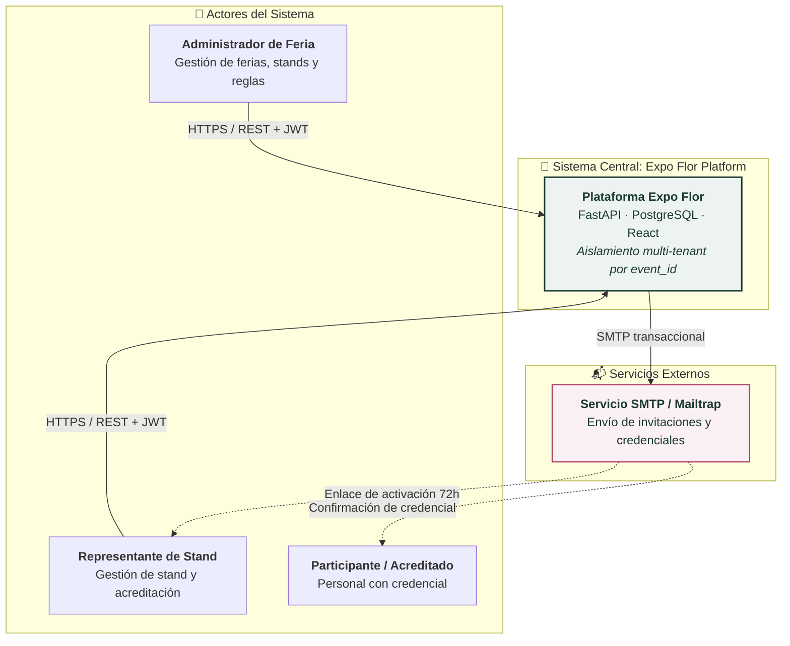
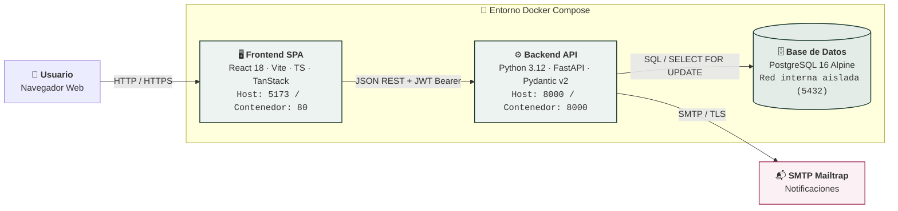
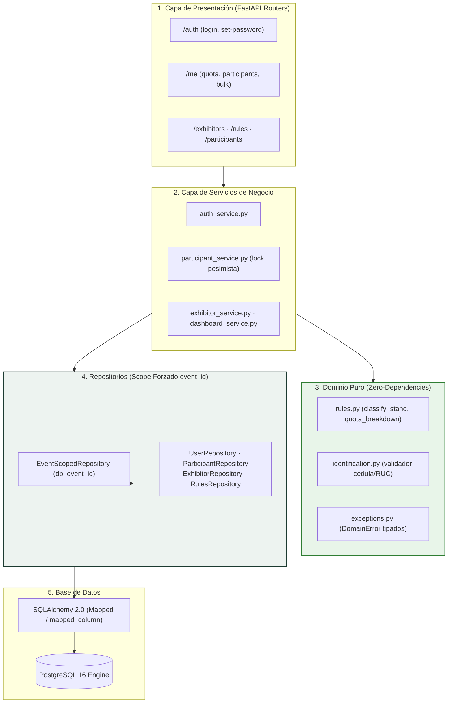
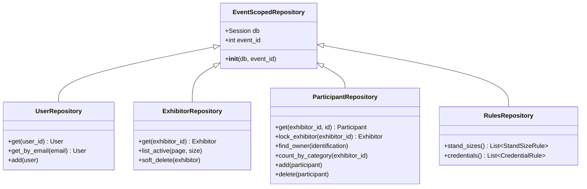
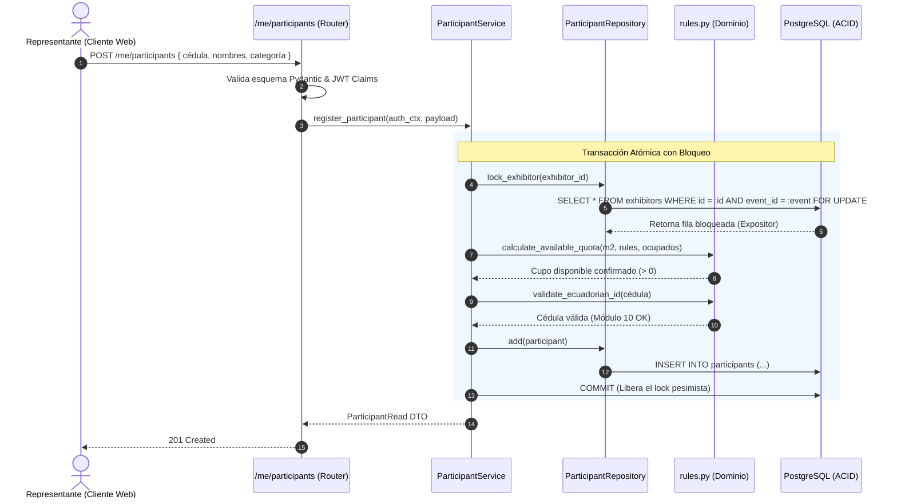

# 🏛️ Documento de Arquitectura de Software (Modelo C4 & Capas)
## Sistema de Gestión de Acreditaciones Multi-Tenant — *Expo Flor Ecuador*

---

### Control del Documento
- **Documento ID:** DOC-01-ARQ-C4
- **Estándar:** ISO/IEC/IEEE 42010:2011 / arc42 Sección 3, 4 y 5
- **Versión:** 1.0.0
- **Fecha:** 2026-09-04

---

## 1. Visión General y Principios de Arquitectura

La arquitectura de **Expo Flor Ecuador** ha sido diseñada bajo los principios de **Clean Architecture (Arquitectura Limpia)**, **Separation of Concerns (SoC)** y **Zero-Trust Multi-Tenancy**. El sistema desacopla estrictamente las reglas de negocio de los detalles de infraestructura y protocolos de transporte.

### Principios Rectores:
1. **Dominio Puro sin Dependencias:** La capa de dominio (`app/domain`) no tiene dependencias de librerías externas (ni FastAPI, ni SQLAlchemy, ni Pydantic). Contiene únicamente lógica pura de Python, reglas matemáticas y algoritmos de validación deterministas.
2. **Aislamiento Multi-Tenant Forzado en Repositorios:** Todas las consultas y mutaciones de datos heredan de `EventScopedRepository(db, event_id)`, inyectando de forma forzada el filtro `event_id` en todas las sentencias SQL.
3. **Control Transaccional Centralizado:** La sesión de base de datos se maneja mediante inyección de dependencias (`Depends(get_db)`), garantizando transacciones atómicas con *commit* explícito y *rollback* ante excepciones.
4. **Desacoplamiento Frontend/Backend:** Comunicación estricta mediante API REST sin estado (*Stateless*), autenticación por tokens JWT Bearer y tipado estático compartido generado desde OpenAPI.

---

## 2. Diagrama C4 Nivel 1: Contexto del Sistema

El siguiente diagrama ilustra los usuarios principales, las fronteras del sistema y los servicios externos involucrados:



### Descripción de Actores y Sistemas:
- **Administrador de Feria:** Usuario con privilegios globales. Configura parámetros de la feria, rangos de metraje, factores de credenciales, registra expositores y monitorea métricas de ocupación en tiempo real.
- **Representante de Stand:** Usuario delegado por una empresa expositora. Recibe un enlace de invitación temporal (72h), activa su cuenta y administra sus cupos acreditando personal de forma manual o mediante importación XLSX.
- **Participante / Acreditado:** Receptor final de la credencial física o digital para ingresar a la feria.
- **Servicio SMTP:** Pasarela de mensajería para entrega transaccional asíncrona de invitaciones y credenciales de acceso.

---

## 3. Diagrama C4 Nivel 2: Contenedores del Sistema

El sistema se orquesta mediante contenedores Docker aislados en una red privada virtual:



### Especificación de Contenedores:
1. **Frontend SPA (Nginx / React 19):**
   - Sirve la aplicación cliente precompilada en Vite.
   - Aplica enrutamiento del lado del cliente (`react-router-dom`), manejo de estado y validación previa de archivos Excel en memoria del navegador mediante SheetJS.
2. **Backend API (FastAPI / Uvicorn):**
   - Ejecuta la API REST en Python 3.12.
   - Entrypoint con migración automática de esquema (`alembic upgrade head`), inserción de datos iniciales (`seed_data.py`) y arranque de Uvicorn con 1 worker por contenedor.
3. **Base de Datos (PostgreSQL 16 Alpine):**
   - Motor relacional ACID con soporte para transacciones serializables, tipos de datos enriquecidos y volumen persistente (`pgdata`).
   - El puerto 5432 no se expone al host en entornos de producción, comunicándose exclusivamente a través de la red interna Docker `backend_net`.

---

## 4. Diagrama C4 Nivel 3: Componentes del Backend (Clean Architecture)

El Backend sigue un flujo unidireccional de dependencias estructurado en 5 capas concéntricas:



### Responsabilidades por Capa:

| Capa | Módulos | Responsabilidad Técnica |
| :--- | :--- | :--- |
| **1. Presentación (API Routers)** | `app/routers/` | Recepción de peticiones HTTP, parseo y validación de esquemas Pydantic v2, extracción de `AuthContext` desde JWT, mapeo de excepciones de dominio a respuestas RFC 7807. |
| **2. Servicios de Aplicación** | `app/services/` | Orquestación de casos de uso, coordinación de transacciones, invocación de algoritmos de dominio y despacho de tareas asíncronas (envío de correos). |
| **3. Dominio Puro** | `app/domain/` | Fórmulas matemáticas de cupos, algoritmos de módulo 10/11 para cédulas ecuatorianas y excepciones de negocio (`DomainError`). Código 100% aislado. |
| **4. Repositorios** | `app/repositories/` | Abstracción de persistencia con ámbito forzado por `event_id`. Adquisición de bloqueos pesimistas (`with_for_update()`) y consultas parametrizadas. |
| **5. Modelos ORM e Infraestructura** | `app/models/`, `app/core/` | Definiciones declarativas SQLAlchemy 2.0 (`Mapped`, `mapped_column`), migraciones Alembic, hashing de contraseñas y emisión de JWT. |

---

## 5. Diagrama UML de Clases de la Capa de Repositorios

Todos los repositorios heredan de `EventScopedRepository`, garantizando que ninguna consulta pueda escapar del contexto del evento activo:



### Implementación del Patrón Multi-Tenant en Repositorio:
```python
class EventScopedRepository:
    """Clase base que asegura el particionamiento lógico de datos."""
    def __init__(self, db: Session, event_id: int):
        if not event_id:
            raise ValueError("event_id is strictly required for scoping")
        self.db = db
        self.event_id = event_id
```

---

## 6. Flujo de Control de una Petición de Acreditación


