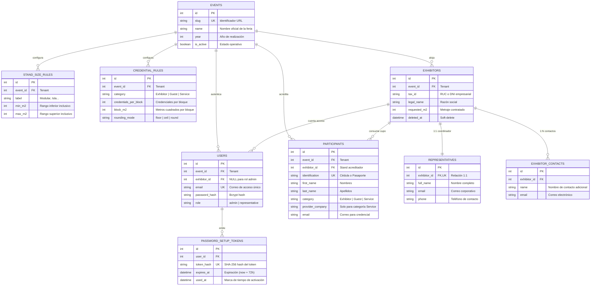

# 🗄️ Modelo de Datos y Diccionario de Base de Datos
## Sistema de Gestión de Acreditaciones Multi-Tenant — *Expo Flor Ecuador*

---

### Control del Documento
- **Documento ID:** DOC-02-BD-DER
- **Estándar:** IEEE Std 1016-2009 / arc42 Sección 8
- **Versión:** 1.0.0
- **Fecha:** 2026-09-04

---

## 1. Diagrama Entidad-Relación (DER Físico)

El esquema de base de datos en **PostgreSQL 16** está estructurado alrededor de la entidad raíz `events` para soportar multi-tenancy nativo:



---

## 2. Diccionario de Datos Exhaustivo

A continuación se detalla la especificación de cada tabla, columna, tipo de dato, restricciones e índices:

### 2.1. Tabla: `events` (Eventos / Ferias)
Frontera de particionamiento lógico multi-tenant.

| Columna | Tipo SQL | Nulo | Clave / Restricción | Descripción |
| :--- | :--- | :---: | :---: | :--- |
| `id` | `INTEGER` | NO | **PK** (Serial) | Identificador numérico primario del evento. |
| `slug` | `VARCHAR(64)` | NO | **UNIQUE** | Código URL seguro (ej. `expoflor-2026`). |
| `name` | `VARCHAR(255)` | NO | — | Nombre formal del evento ferial. |
| `year` | `INTEGER` | NO | `CHECK (year >= 2020)` | Año cronológico de realización. |
| `is_active` | `BOOLEAN` | NO | `DEFAULT TRUE` | Bandera de operatividad en la plataforma. |
| `created_at` | `TIMESTAMPTZ` | NO | `DEFAULT NOW()` | Fecha y hora de creación del registro. |
| `updated_at` | `TIMESTAMPTZ` | NO | `DEFAULT NOW()` | Fecha y hora de última modificación. |

---

### 2.2. Tabla: `stand_size_rules` (Reglas de Clasificación de Stands)
Define las categorías descriptivas de stand según el metraje contratado.

| Columna | Tipo SQL | Nulo | Clave / Restricción | Descripción |
| :--- | :--- | :---: | :---: | :--- |
| `id` | `INTEGER` | NO | **PK** (Serial) | Identificador primario de la regla de clasificación. |
| `event_id` | `INTEGER` | NO | **FK** (`events.id` ON DELETE CASCADE) | Evento al que pertenece la regla. |
| `label` | `VARCHAR(64)` | NO | — | Etiqueta comercial (ej. `Modular`, `Isla Básica`, `Isla Grande`). |
| `min_m2` | `INTEGER` | NO | `CHECK (min_m2 >= 1)` | Límite inferior de metraje inclusivo ($m^2$). |
| `max_m2` | `INTEGER` | NO | `CHECK (max_m2 >= min_m2)` | Límite superior de metraje inclusivo ($m^2$). |
| `created_at` | `TIMESTAMPTZ` | NO | `DEFAULT NOW()` | Fecha de registro de la regla. |

---

### 2.3. Tabla: `credential_rules` (Reglas de Cupos de Credenciales)
Define la fórmula matemática de asignación de cupos por categoría de participante.

| Columna | Tipo SQL | Nulo | Clave / Restricción | Descripción |
| :--- | :--- | :---: | :---: | :--- |
| `id` | `INTEGER` | NO | **PK** (Serial) | Identificador primario de la regla de credencial. |
| `event_id` | `INTEGER` | NO | **FK** (`events.id` ON DELETE CASCADE) | Evento al que aplica la fórmula. |
| `category` | `VARCHAR(32)` | NO | `CHECK (category IN ('Exhibitor', 'Guest', 'Service'))` | Tipo de credencial objetivo. |
| `credentials_per_block` | `INTEGER` | NO | `CHECK (credentials_per_block >= 1)` | Número de credenciales otorgadas por cada bloque. |
| `block_m2` | `INTEGER` | NO | `CHECK (block_m2 >= 1)` | Tamaño del bloque de metraje divisor ($m^2$). |
| `rounding_mode` | `VARCHAR(16)` | NO | `CHECK (rounding_mode IN ('floor', 'ceil', 'round'))` | Algoritmo de aproximación numérica. |
| `created_at` | `TIMESTAMPTZ` | NO | `DEFAULT NOW()` | Fecha de configuración de la regla. |

---

### 2.4. Tabla: `exhibitors` (Empresas Expositoras)
Almacena la información contractual de los stands de la feria.

| Columna | Tipo SQL | Nulo | Clave / Restricción | Descripción |
| :--- | :--- | :---: | :---: | :--- |
| `id` | `INTEGER` | NO | **PK** (Serial) | Identificador numérico del expositor. |
| `event_id` | `INTEGER` | NO | **FK** (`events.id` ON DELETE RESTRICT) | Evento ferial en el que participa. |
| `tax_id` | `VARCHAR(32)` | NO | — | Identificador fiscal (RUC/DNI empresarial). |
| `legal_name` | `VARCHAR(255)` | NO | — | Razón social o nombre legal de la compañía. |
| `requested_m2` | `INTEGER` | NO | `CHECK (requested_m2 >= 1)` | Área total contratada en metros cuadrados ($m^2$). |
| `deleted_at` | `TIMESTAMPTZ` | SÍ | `DEFAULT NULL` | Marca de tiempo para *soft-delete*. |
| `created_at` | `TIMESTAMPTZ` | NO | `DEFAULT NOW()` | Fecha de registro del expositor. |
| `updated_at` | `TIMESTAMPTZ` | NO | `DEFAULT NOW()` | Fecha de última actualización. |

> **Invariante SQL de Unicidad Activa:**
> Se implementa un índice parcial único para permitir re-registro de un `tax_id` si el anterior fue eliminado por soft-delete:
> `CREATE UNIQUE INDEX uq_exhibitor_tax_active ON exhibitors (event_id, tax_id) WHERE deleted_at IS NULL;`

---

### 2.5. Tabla: `representatives` (Representantes de Stand)
Persona de contacto principal designada por la empresa expositora (Relación 1:1).

| Columna | Tipo SQL | Nulo | Clave / Restricción | Descripción |
| :--- | :--- | :---: | :---: | :--- |
| `id` | `INTEGER` | NO | **PK** (Serial) | Identificador primario del representante. |
| `exhibitor_id` | `INTEGER` | NO | **FK**, **UNIQUE** (`exhibitors.id` ON DELETE CASCADE) | Garantiza exactamente 1 representante por expositor. |
| `full_name` | `VARCHAR(255)` | NO | — | Nombre y apellidos del representante. |
| `email` | `VARCHAR(255)` | NO | — | Correo corporativo para notificaciones. |
| `phone` | `VARCHAR(32)` | NO | — | Teléfono de contacto directo. |
| `created_at` | `TIMESTAMPTZ` | NO | `DEFAULT NOW()` | Fecha de asignación del representante. |
| `updated_at` | `TIMESTAMPTZ` | NO | `DEFAULT NOW()` | Fecha de actualización de datos. |

---

### 2.6. Tabla: `exhibitor_contacts` (Contactos Adicionales)
Contactos secundarios o comerciales del stand (Relación 1:N).

| Columna | Tipo SQL | Nulo | Clave / Restricción | Descripción |
| :--- | :--- | :---: | :---: | :--- |
| `id` | `INTEGER` | NO | **PK** (Serial) | Identificador primario del contacto adicional. |
| `exhibitor_id` | `INTEGER` | NO | **FK** (`exhibitors.id` ON DELETE CASCADE) | Expositor al que pertenece el contacto. |
| `name` | `VARCHAR(255)` | NO | — | Nombre del contacto secundario. |
| `email` | `VARCHAR(255)` | NO | — | Correo electrónico de notificación. |
| `created_at` | `TIMESTAMPTZ` | NO | `DEFAULT NOW()` | Fecha de registro. |

---

### 2.7. Tabla: `users` (Cuentas de Acceso y Seguridad)
Credenciales de acceso al sistema con segregación de roles.

| Columna | Tipo SQL | Nulo | Clave / Restricción | Descripción |
| :--- | :--- | :---: | :---: | :--- |
| `id` | `INTEGER` | NO | **PK** (Serial) | Identificador primario de usuario. |
| `event_id` | `INTEGER` | NO | **FK** (`events.id` ON DELETE CASCADE) | Ámbito de pertenencia del usuario. |
| `exhibitor_id` | `INTEGER` | SÍ | **FK** (`exhibitors.id` ON DELETE CASCADE) | NULL para administradores globales; poblado para representantes. |
| `email` | `VARCHAR(255)` | NO | **UNIQUE** (`event_id`, `email`) | Correo de autenticación único por evento. |
| `password_hash` | `VARCHAR(255)` | SÍ | — | Hash de contraseña (Bcrypt). NULL si aún no activa su cuenta. |
| `role` | `VARCHAR(32)` | NO | `CHECK (role IN ('admin', 'representative'))` | Rol de control de acceso RBAC. |
| `created_at` | `TIMESTAMPTZ` | NO | `DEFAULT NOW()` | Fecha de alta de la cuenta. |
| `updated_at` | `TIMESTAMPTZ` | NO | `DEFAULT NOW()` | Fecha de última modificación. |

---

### 2.8. Tabla: `password_setup_tokens` (Tokens de Activación 72h)
Gestión de enlaces *Magic Link* para activación inicial o reseteo de contraseña.

| Columna | Tipo SQL | Nulo | Clave / Restricción | Descripción |
| :--- | :--- | :---: | :---: | :--- |
| `id` | `INTEGER` | NO | **PK** (Serial) | Identificador numérico del token. |
| `user_id` | `INTEGER` | NO | **FK** (`users.id` ON DELETE CASCADE) | Usuario destinatario del token. |
| `token_hash` | `VARCHAR(64)` | NO | **UNIQUE** | Hash SHA-256 del token plano enviado por correo. |
| `expires_at` | `TIMESTAMPTZ` | NO | — | Límite temporal de validez (72 horas desde emisión). |
| `used_at` | `TIMESTAMPTZ` | SÍ | `DEFAULT NULL` | Fecha y hora en la que fue consumido. |
| `created_at` | `TIMESTAMPTZ` | NO | `DEFAULT NOW()` | Fecha de emisión. |

---

### 2.9. Tabla: `participants` (Participantes y Credenciales)
Registro de personas acreditadas por stand.

| Columna | Tipo SQL | Nulo | Clave / Restricción | Descripción |
| :--- | :--- | :---: | :---: | :--- |
| `id` | `INTEGER` | NO | **PK** (Serial) | Identificador primario del participante. |
| `event_id` | `INTEGER` | NO | **FK** (`events.id` ON DELETE CASCADE) | Evento ferial. |
| `exhibitor_id` | `INTEGER` | NO | **FK** (`exhibitors.id` ON DELETE CASCADE) | Stand responsable de la acreditación. |
| `identification` | `VARCHAR(32)` | NO | — | Cédula ecuatoriana, RUC o pasaporte. |
| `first_name` | `VARCHAR(128)` | NO | — | Nombres del acreditado. |
| `last_name` | `VARCHAR(128)` | NO | — | Apellidos del acreditado. |
| `category` | `VARCHAR(32)` | NO | `CHECK (category IN ('Exhibitor', 'Guest', 'Service'))` | Categoría de la credencial emitida. |
| `provider_company` | `VARCHAR(255)` | SÍ | — | Empresa prestadora de servicios (Obligatorio si `category == 'Service'`). |
| `email` | `VARCHAR(255)` | SÍ | — | Correo electrónico opcional para entrega digital. |
| `credential_notified_at` | `TIMESTAMPTZ` | SÍ | `DEFAULT NULL` | Fecha de despacho del correo con credencial. |
| `created_at` | `TIMESTAMPTZ` | NO | `DEFAULT NOW()` | Fecha de registro. |
| `updated_at` | `TIMESTAMPTZ` | NO | `DEFAULT NOW()` | Fecha de última edición. |

> **Invariante SQL de Unicidad de Participante:**
> `CREATE UNIQUE INDEX uq_participant_event_id ON participants (event_id, identification);`
> *Regla:* Una persona natural no puede ser acreditada dos veces en la misma feria, ni por el mismo stand ni por stands distintos.

---

## 3. Invariantes y Reglas de Integridad de Base de Datos

```
┌────────────────────────────────────────────────────────────────────────┐
│                   MATRIZ DE INVARIANTES DE PERSISTENCIA                │
├────────────────────────────────┬───────────────────────────────────────┤
│ Invariante de Negocio          │ Mecanismo de Garantía en BD / Repos   │
├────────────────────────────────┼───────────────────────────────────────┤
│ Unicidad de Cédula en Feria    │ Índice único `(event_id, identification)` │
│ Consumo de Cupo No Excedible   │ `SELECT ... FOR UPDATE` + validación  │
│ Aislamiento Multi-Tenant       │ `EventScopedRepository` en todo query │
│ Soft-Delete no bloquea re-alta │ Índice único parcial `WHERE deleted_at IS NULL` │
│ TTL de Tokens de Activación    │ `expires_at > NOW()` AND `used_at IS NULL` │
│ Eliminación y Liberación       │ Hard-delete físico en `participants`  │
└────────────────────────────────┴───────────────────────────────────────┘
```
