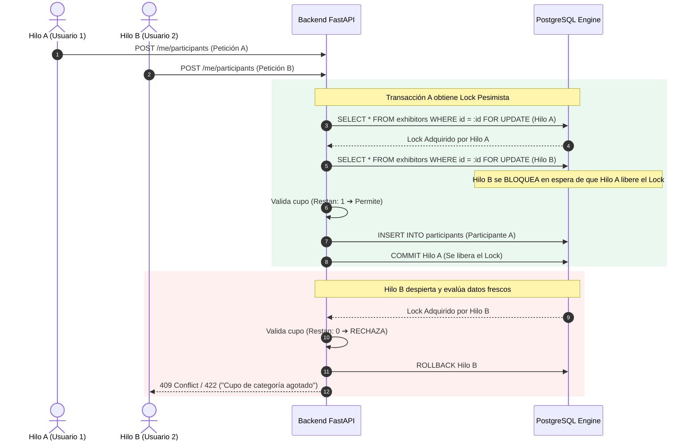
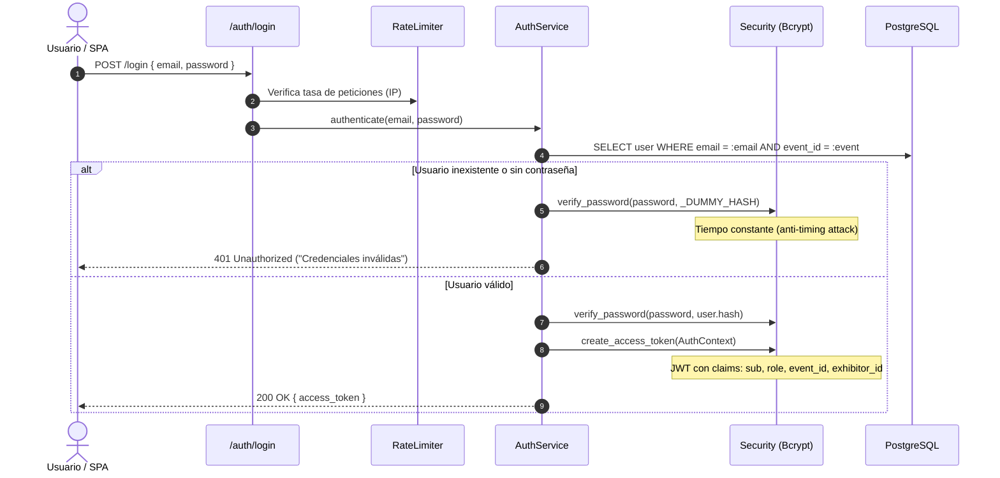
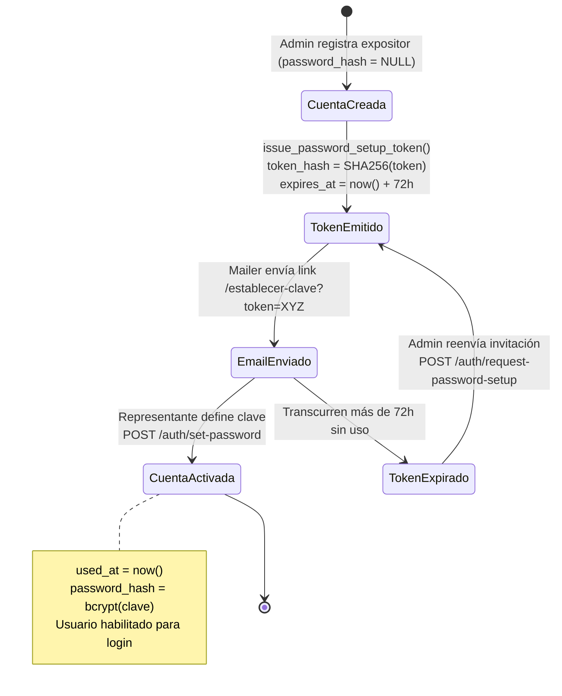
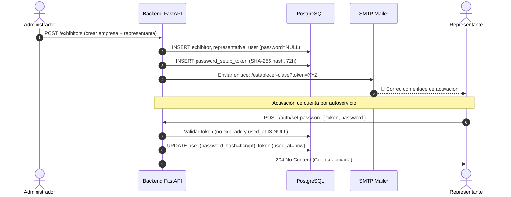

# 🛡️ Seguridad, Control de Concurrencia y Modelo de Amenazas (STRIDE)
## Sistema de Gestión de Acreditaciones Multi-Tenant — *Expo Flor Ecuador*

---

### Control del Documento
- **Documento ID:** DOC-03-SEC-STRIDE
- **Estándar:** STRIDE Threat Model / ISO/IEC 27001 / OWASP Top 10
- **Versión:** 1.0.0
- **Fecha:** 2026-09-04

---

## 1. Modelo de Amenazas STRIDE

Se aplicó la metodología **STRIDE** (Microsoft / OWASP) para identificar vectores de ataque potenciales y definir las defensas correspondientes:

| Categoría STRIDE | Amenaza Identificada | Vector de Ataque | Mecanismo de Mitigación Implementado |
| :--- | :--- | :--- | :--- |
| **S - Spoofing** *(Suplantación)* | Un atacante suplanta a un expositor para emitir credenciales ilegítimas. | Forzado de JWT sin firma o robo de tokens de sesión. | JWT firmado con `HS256` y clave secreta criptográfica de 256 bits. Validación estricta de claims `sub`, `event_id` y `role` en cada endpoint mediante inyección de dependencias. |
| **T - Tampering** *(Alteración)* | Modificación de cupos de acreditación o alteración de metraje $m^2$. | Inyección SQL o manipulación de parámetros en el payload HTTP. | Uso exclusivo de ORM parametrizado (SQLAlchemy 2.0 Core/ORM), validación estricta con Pydantic v2 y cálculo de cupos exclusivo en el servidor (`rules.py`). |
| **R - Repudiation** *(Repudio)* | Un representante niega haber registrado o eliminado a un participante. | Falta de trazabilidad en mutaciones críticas. | Marcas de tiempo de auditoría (`created_at`, `updated_at`), registro de notificaciones (`credential_notified_at`) y logs estructurados por petición. |
| **I - Information Disclosure** *(Fuga de Información)* | Fuga de lista de participantes de un stand competidor o enumeración de correos. | Ataque de timing en login o acceso a endpoints sin filtro de stand. | Comparación de contraseñas en tiempo constante con `_DUMMY_HASH` (anti-timing), y filtro obligatorio por `exhibitor_id` en todas las consultas de expositor. |
| **D - Denial of Service** *(Denegación de Servicio)* | Saturación de endpoints de autenticación o procesamiento de XLSX gigantes. | Fuerza bruta en `/auth/login` o subida de archivos ZIP/XLSX maliciosos. | Rate Limiter por IP, validación previa del tamaño de archivo y parsing en streaming/memoria limitada con SheetJS y Pydantic. |
| **E - Elevation of Privilege** *(Elevación de Privilegios)* | Un representante accede a funciones administrativas (cambio de reglas de feria). | Llamada directa a rutas `/exhibitors` o `/rules` manipulando el cliente. | Middlewares y dependencias de autorización RBAC (`RequireRole('admin')`) evaluadas en el servidor para cada ruta protegida. |

---

## 2. Control de Concurrencia y Mitigación de Race Conditions

### 2.1. El Problema del *Double-Spending* de Cupos
Cuando múltiples usuarios o pestañas del navegador intentan acreditar participantes de forma simultánea para un mismo stand al que le resta exactamente 1 cupo disponible, puede ocurrir una condición de carrera (*Race Condition*):

```
Hilo A (Usuario 1): Lee cupo disponible = 1  ──────────┐
Hilo B (Usuario 2): Lee cupo disponible = 1  ─────┐    │ Ambas transacciones
Hilo A: Inserta participante A               ─────┼────┘ creen que hay cupo
Hilo B: Inserta participante B               ─────┘      ➔ Sobre-emisión de cupos (Error grave)
```

### 2.2. Solución: Bloqueo Pesimista a Nivel de Fila (`SELECT ... FOR UPDATE`)
Para erradicar completamente esta vulnerabilidad, el backend adquiere un bloqueo pesimista sobre el registro del expositor en PostgreSQL:

```sql
-- Sentencia ejecutada dentro de la transacción de acreditación
SELECT * FROM exhibitors 
WHERE id = :exhibitor_id AND event_id = :event_id 
FOR UPDATE;
```



> **Verificación en Pruebas:**
> El test de integración `tests/integration/test_quota_concurrency.py` somete al backend a ráfagas de hilos concurrentes compitiendo por el último cupo, confirmando matemáticamente que nunca se excede el límite permitido.

---

## 3. Arquitectura de Autenticación y Prevención de Ataques de Timing

Para prevenir la enumeración de usuarios legítimos a través de la medición de tiempos de respuesta del servidor (*Timing Attack*), la función de autenticación ejecuta una verificación criptográfica de tiempo constante con un hash sintético (`_DUMMY_HASH`) cuando el correo no existe en la base de datos:



---

## 4. Ciclo de Vida y Seguridad de Tokens de Activación (72h TTL)

Los representantes de stand no reciben contraseñas en texto plano. En su lugar, el sistema emite un token criptográfico de un solo uso (*Magic Link*) almacenando únicamente su resumen criptográfico **SHA-256** en la base de datos:



---

## 5. Diagrama de Secuencia: Onboarding Seguro de Expositores


