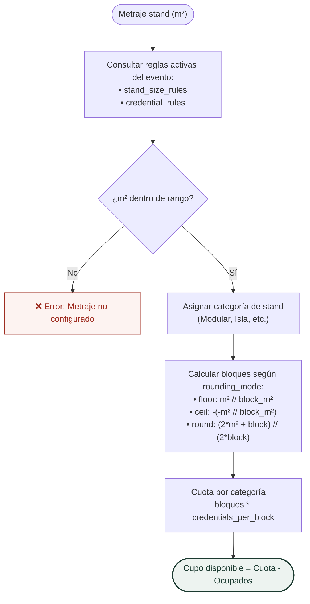

# ⚙️ Motor de Reglas de Negocio, Cálculo de Cupos y Validación de Identidad
## Sistema de Gestión de Acreditaciones Multi-Tenant — *Expo Flor Ecuador*

---

### Control del Documento
- **Documento ID:** DOC-04-DOM-REGLAS
- **Estándar:** arc42 Sección 6 / IEEE Std 1016-2009
- **Versión:** 1.0.0
- **Fecha:** 2026-09-04

---

## 1. Clasificación de Stands por Metraje ($m^2$)

El sistema parametriza dinámicamente las etiquetas comerciales de los stands según el área contratada en metros cuadrados:

| Etiqueta Comercial (`label`) | Rango Mínimo ($m^2$) | Rango Máximo ($m^2$) | Descripción del Tipo de Stand |
| :--- | :---: | :---: | :--- |
| **Modular Pequeño** | 1 | 12 | Stand estándar básico prearmado para microexpositores. |
| **Modular Estándar** | 13 | 24 | Stand tradicional con divisiones modulares estándar. |
| **Isla Media** | 25 | 48 | Espacio abierto con acceso por múltiples pasillos. |
| **Isla Grande** | 49 | 99 | Gran área de exhibición central. |
| **Pabellón Corporativo** | 100 | 500 | Área mayor reservada para delegaciones o empresas multinacionales. |

---

## 2. Algoritmo de Cálculo de Cuotas de Acreditación

Las credenciales otorgadas a cada expositor se calculan mediante la siguiente ecuación general:

$$\text{Cuota Total}(\text{categoría}) = \text{Bloques}(m^2, \text{block\_m2}, \text{rounding\_mode}) \times \text{credentials\_per\_block}$$

### 2.1. Fórmulas de Modos de Redondeo (Enteros Puros)
Para garantizar determinismo matemático sin errores de coma flotante (*floating-point inaccuracies*), todos los cálculos se realizan mediante aritmética de enteros en Python:

1. **Modo `floor` (Piso / Por defecto):** Redondeo hacia abajo. Solo se premian bloques completamente completados.
   $$\text{Bloques}_{\text{floor}} = m^2 // \text{block\_m2}$$

2. **Modo `ceil` (Techo):** Redondeo hacia arriba. Cualquier fracción de metraje otorga el bloque completo.
   $$\text{Bloques}_{\text{ceil}} = -(-m^2 // \text{block\_m2})$$

3. **Modo `round` (Aritmético):** Redondeo estándar al entero más cercano con desempate al alza ($\ge 0.5 \to +1$).
   $$\text{Bloques}_{\text{round}} = (2 \cdot m^2 + \text{block\_m2}) // (2 \cdot \text{block\_m2})$$

---

## 3. Matriz de Ejemplos de Asignación de Cupos

Tomando la configuración estándar de feria:
- **Expositor (`Exhibitor`):** 2 credenciales por cada bloque de $12\,m^2$.
- **Invitado (`Guest`):** 1 credencial por cada bloque de $12\,m^2$.
- **Servicio (`Service`):** 1 credencial por cada bloque de $24\,m^2$.

| Metraje Stand ($m^2$) | Modo Redondeo | Cupo Exhibitor ($12m^2 \to 2$) | Cupo Guest ($12m^2 \to 1$) | Cupo Service ($24m^2 \to 1$) | Total Credenciales |
| :---: | :---: | :---: | :---: | :---: | :---: |
| **$6\,m^2$** | `floor` | $0 \times 2 = \mathbf{0}$ | $0 \times 1 = \mathbf{0}$ | $0 \times 1 = \mathbf{0}$ | **0** |
| **$6\,m^2$** | `round` | $1 \times 2 = \mathbf{2}$ | $1 \times 1 = \mathbf{1}$ | $0 \times 1 = \mathbf{0}$ | **3** |
| **$6\,m^2$** | `ceil` | $1 \times 2 = \mathbf{2}$ | $1 \times 1 = \mathbf{1}$ | $1 \times 1 = \mathbf{1}$ | **4** |
| **$12\,m^2$** | *Cualquiera* | $1 \times 2 = \mathbf{2}$ | $1 \times 1 = \mathbf{1}$ | $0 \times 1 = \mathbf{0}$ | **3** |
| **$18\,m^2$** | `floor` | $1 \times 2 = \mathbf{2}$ | $1 \times 1 = \mathbf{1}$ | $0 \times 1 = \mathbf{0}$ | **3** |
| **$18\,m^2$** | `round` | $2 \times 2 = \mathbf{4}$ | $2 \times 1 = \mathbf{2}$ | $1 \times 1 = \mathbf{1}$ | **7** |
| **$24\,m^2$** | *Cualquiera* | $2 \times 2 = \mathbf{4}$ | $2 \times 1 = \mathbf{2}$ | $1 \times 1 = \mathbf{1}$ | **7** |
| **$36\,m^2$** | *Cualquiera* | $3 \times 2 = \mathbf{6}$ | $3 \times 1 = \mathbf{3}$ | $1 \times 1 = \mathbf{1}$ | **10** |
| **$48\,m^2$** | *Cualquiera* | $4 \times 2 = \mathbf{8}$ | $4 \times 1 = \mathbf{4}$ | $2 \times 1 = \mathbf{2}$ | **14** |

---

## 4. Diagrama de Flujo del Motor de Reglas



---

## 5. Reglas de Validación de Participantes

### 5.1. Categorías y Restricciones Estructurales

```
┌────────────────────────────────────────────────────────────────────────┐
│                   REGLAS POR CATEGORÍA DE PARTICIPANTE                 │
├───────────────┬──────────────────────┬─────────────────────────────────┤
│ Categoría     │ Consumo de Cupo      │ Restricción de Dominio          │
├───────────────┼──────────────────────┼─────────────────────────────────┤
│ Exhibitor     │ 1 cupo de Exhibitor  │ Personal directo del stand      │
│ Guest         │ 1 cupo de Guest      │ Invitado comercial o cliente    │
│ Service       │ 1 cupo de Service    │ Requiere `provider_company`     │
└───────────────┴──────────────────────┴─────────────────────────────────┘
```

> **Invariante de Negocio para Service:**
> Si `category == 'Service'`, el campo `provider_company` es **OBLIGATORIO** (no puede ser nulo ni vacío). Para cualquier otra categoría, el campo debe ser omitido o `NULL`.

---

## 6. Algoritmos de Validación de Documentos de Identidad (Ecuador)

El módulo puro [`app/domain/identification.py`](file:///home/jhon/Documentos/Expoflores/backend/app/domain/identification.py) implementa la verificación estricta de documentos oficiales ecuatorianos:

### 6.1. Cédula de Identidad Ecuatoriana (10 Dígitos)
1. **Longitud:** Exactamente 10 dígitos numéricos.
2. **Código Provincial (Dígitos 1-2):** Debe pertenecer al rango $[01, 24]$ o al código especial consular $30$.
3. **Tercer Dígito:** Debe ser menor a 6 ($< 6$).
4. **Algoritmo Módulo 10:**
   - Coeficientes multiplicadores: `[2, 1, 2, 1, 2, 1, 2, 1, 2]`.
   - Para cada uno de los primeros 9 dígitos, se multiplica por su coeficiente. Si el producto es $\ge 10$, se le resta 9.
   - Se suman todos los resultados parciales.
   - Dígito verificador esperado: $(10 - (\text{Suma} \pmod{10})) \pmod{10}$.
   - Debe coincidir exactamente con el décimo dígito.

### 6.2. RUC Persona Natural (13 Dígitos)
- Los primeros 10 dígitos deben conformar una cédula ecuatoriana válida según el algoritmo Módulo 10.
- Los últimos 3 dígitos corresponden al código de establecimiento y deben ser `001`.

### 6.3. RUC Sociedad Privada o Extranjera (13 Dígitos)
- Dígitos 1-2: Código provincial válido.
- Tercer dígito: Exactamente $9$.
- Coeficientes Módulo 11 (primeros 9 dígitos): `[4, 3, 2, 7, 6, 5, 4, 3, 2]`.
- Dígito verificador en la décima posición: $11 - (\text{Suma} \pmod{11})$ (Si residuo es 0, verificador es 0).
- Establecimiento (dígitos 10-13): `0001`.

### 6.4. Pasaporte / Identificación Extranjera
- Longitud entre 4 y 20 caracteres alfanuméricos (`^[A-Z0-9\-]{4,20}$`).
- Permite la acreditación de delegados y visitantes internacionales.
