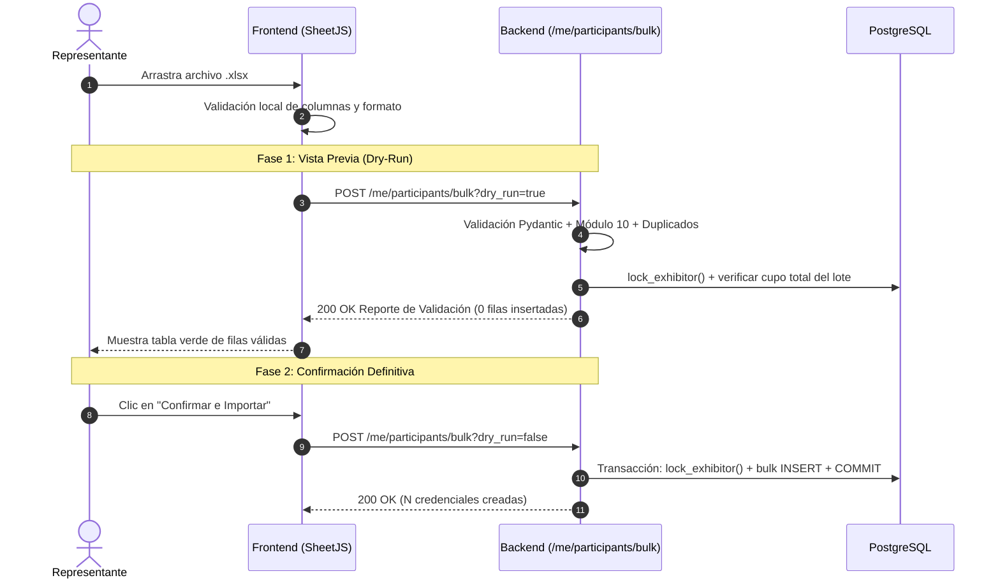

# 📡 Contratos de la API REST y Topología de Errores RFC 7807
## Sistema de Gestión de Acreditaciones Multi-Tenant — *Expo Flor Ecuador*

---

### Control del Documento
- **Documento ID:** DOC-05-API-RFC7807
- **Estándar:** RFC 7807 (Problem Details for HTTP APIs) / OpenAPI 3.1.0
- **Versión:** 1.0.0
- **Fecha:** 2026-09-04

---

## 1. Convenciones y Estándares de la API

La API de **Expo Flor Ecuador** sigue el estilo arquitectónico **RESTful** con las siguientes directrices:
- **Transporte Seguro:** Exclusivamente HTTPS en entornos públicos con cifrado TLS 1.3.
- **Autenticación:** Encabezado HTTP `Authorization: Bearer <JWT_TOKEN>`.
- **Formato de Carga:** Peticiones y respuestas serializadas en `application/json` (UTF-8).
- **Control de Versiones:** Esquema declarativo tipado generado mediante `openapi-typescript`.
- **Estructura de Errores:** Respuestas de error estandarizadas bajo **RFC 7807 (Problem Details)** con `Content-Type: application/problem+json`.

---

## 2. Catálogo de Endpoints de la API

### 2.1. Módulo: Autenticación & Onboarding (`/auth`)

| Método | Ruta | Rol Mínimo | Descripción |
| :--- | :--- | :---: | :--- |
| `POST` | `/auth/login` | Público | Autenticación con email/password. Retorna JWT Bearer. |
| `POST` | `/auth/request-password-setup` | `admin` | Reenvía el Magic Link de activación a un expositor. |
| `POST` | `/auth/forgot-password` | Público | Recuperación self-service: emite y envía un Magic Link nuevo. Rate limit igual que `login`; responde 202 exista o no el correo. |
| `POST` | `/auth/set-password` | Público | Consume token de 72h y establece contraseña (inicial o restablecida). |
| `GET` | `/auth/me` | Autenticado | Retorna el perfil y contexto del usuario activo. |

---

### 2.2. Módulo: Gestión del Stand Propio (`/me`) — *Representante*

| Método | Ruta | Rol Mínimo | Descripción |
| :--- | :--- | :---: | :--- |
| `GET` | `/me/stand` | `representative` | Obtiene los datos generales del stand asignado. |
| `GET` | `/me/quota` | `representative` | Obtiene el desglose de cupos (totales, ocupados y disponibles). |
| `GET` | `/me/participants` | `representative` | Lista los participantes acreditados por el stand. |
| `POST` | `/me/participants` | `representative` | Acredita un nuevo participante con bloqueo pesimista. |
| `PATCH` | `/me/participants/{id}` | `representative` | Actualiza datos del participante (nombres, email). |
| `DELETE` | `/me/participants/{id}` | `representative` | Elimina físicamente y libera el cupo de la categoría. |
| `POST` | `/me/participants/bulk` | `representative` | Carga masiva XLSX con parámetro `?dry_run=true\|false`. |

---

### 2.3. Módulo: Administración de Expositores (`/exhibitors`) — *Admin*

| Método | Ruta | Rol Mínimo | Descripción |
| :--- | :--- | :---: | :--- |
| `GET` | `/exhibitors` | `admin` | Lista paginada de expositores con filtros de búsqueda. |
| `POST` | `/exhibitors` | `admin` | Registra empresa, representante y emite token 72h. |
| `GET` | `/exhibitors/{id}` | `admin` | Detalle completo de un expositor y métricas de cupos. |
| `PATCH` | `/exhibitors/{id}` | `admin` | Modifica metraje $m^2$, razón social o datos de contacto. |
| `DELETE` | `/exhibitors/{id}` | `admin` | Ejecuta soft-delete (`deleted_at = NOW()`). |

---

### 2.4. Módulo: Configuración de Reglas de Feria (`/rules`) — *Admin*

| Método | Ruta | Rol Mínimo | Descripción |
| :--- | :--- | :---: | :--- |
| `GET` | `/rules/stand-sizes` | Autenticado | Consulta los rangos de metraje de stands configurados. |
| `PUT` | `/rules/stand-sizes` | `admin` | Actualiza la matriz de clasificación por $m^2$. |
| `GET` | `/rules/credentials` | Autenticado | Consulta las reglas de cálculo de credenciales y redondeo. |
| `PUT` | `/rules/credentials` | `admin` | Modifica factores de bloque y modos de redondeo. |

---

## 3. Estructura Formal de Errores RFC 7807 (Problem Details)

Todas las respuestas de error del sistema adoptan la siguiente estructura JSON uniforme:

```json
{
  "type": "https://expoflor.com/errors/QUOTA_EXCEEDED",
  "title": "Cupo de Acreditación Agotado",
  "status": 422,
  "detail": "El stand no dispone de cupos suficientes para la categoría 'Exhibitor'. Cupo máximo: 4, asignados: 4.",
  "code": "QUOTA_EXCEEDED",
  "params": {
    "category": "Exhibitor",
    "total_quota": 4,
    "used_quota": 4,
    "requested": 1
  }
}
```

---

## 4. Catálogo de Códigos de Error de Dominio

```
┌────────────────────────────────────────────────────────────────────────────────────────┐
│                        CATÁLOGO DE ERRORES TIPADOS DE DOMINIO                          │
├────────────────────────────────────────┬────────┬──────────────────────────────────────┤
│ Código de Error (`code`)               │ HTTP   │ Causa / Condición de Disparo         │
├────────────────────────────────────────┼────────┼──────────────────────────────────────┤
│ `INVALID_CREDENTIALS`                  │ 401    │ Correo o contraseña incorrectos      │
│ `UNAUTHORIZED`                         │ 401    │ Token JWT faltante, expirado o falso │
│ `FORBIDDEN`                            │ 403    │ Rol insuficiente para la operación   │
│ `EXHIBITOR_NOT_FOUND`                  │ 404    │ Expositor inexistente o soft-deleted │
│ `PARTICIPANT_NOT_FOUND`                │ 404    │ Participante no encontrado en stand  │
│ `TOKEN_EXPIRED`                        │ 400    │ Enlace de activación > 72h de vida   │
│ `TOKEN_ALREADY_USED`                   │ 400    │ Enlace de activación ya consumido    │
│ `DUPLICATE_IDENTIFICATION_SAME_EXH`    │ 409    │ Cédula ya acreditada en este stand   │
│ `DUPLICATE_IDENTIFICATION_OTHER_EXH`   │ 409    │ Cédula acreditada en otro stand      │
│ `QUOTA_EXCEEDED`                       │ 422    │ Cupo insuficiente en la categoría    │
│ `STAND_AREA_NOT_CONFIGURED`            │ 422    │ Metraje fuera de los rangos válidos  │
│ `INVALID_IDENTIFICATION_EC`            │ 422    │ Cédula/RUC con dígito inválido (M10) │
│ `SERVICE_PROVIDER_REQUIRED`            │ 422    │ Categoría Service sin empresa proveed│
│ `SERVICE_PROVIDER_FORBIDDEN`           │ 422    │ Empresa proveedora en Exhibitor/Guest│
│ `RATE_LIMIT_EXCEEDED`                  │ 429    │ Demasiadas peticiones por IP         │
│ `INTERNAL_SERVER_ERROR`                │ 500    │ Excepción no controlada del sistema  │
└────────────────────────────────────────┴────────┴──────────────────────────────────────┘
```

---

## 5. Protocolo de Carga Masiva XLSX (Dry-Run en 2 Fases)

### Secuencia del Proceso:


