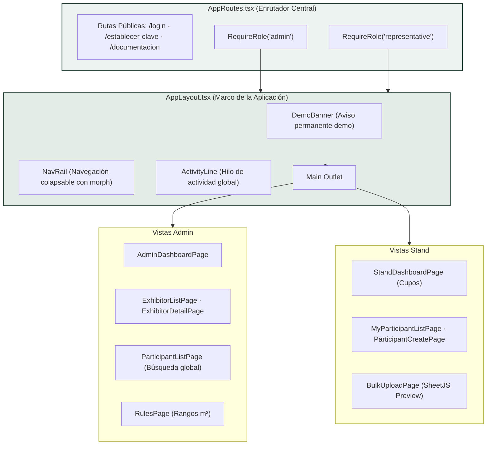
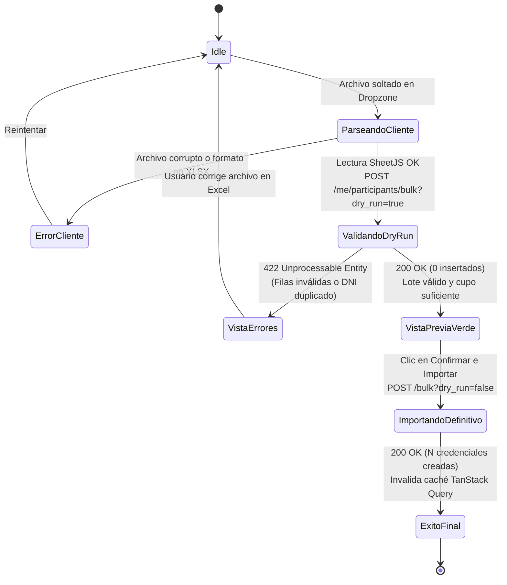

# 🖥️ Arquitectura Frontend, Árbol de Componentes y Flujos UX
## Sistema de Gestión de Acreditaciones Multi-Tenant — *Expo Flor Ecuador*

---

### Control del Documento
- **Documento ID:** DOC-06-FE-UX
- **Estándar:** IEEE Std 1016-2009 / W3C WCAG 2.1 AA
- **Versión:** 1.0.0
- **Fecha:** 2026-09-04

---

## 1. Visión General del Frontend

El frontend de **Expo Flor Ecuador** es una Single Page Application (SPA) construida con tecnologías modernas de alto rendimiento:
- **Core:** React 19 + TypeScript 5.9 (modo estricto).
- **Herramienta de Construcción:** Vite 8 con compilación instantánea y *Tree-Shaking*.
- **Gestión de Estado Asíncrono y Caché:** TanStack Query v5 (React Query).
- **Formularios y Validación:** React Hook Form + Zod (validación tipada cliente).
- **Estilizado:** Tailwind CSS v4 con arquitectura semántica de tokens de color.
- **Procesamiento de Archivos:** SheetJS (XLSX) para análisis de hojas de cálculo directamente en el navegador del cliente.

---

## 2. Diagrama del Árbol de Componentes y Enrutamiento



---

## 3. Máquina de Estados: Flujo de Carga Masiva XLSX

El proceso de importación masiva de credenciales sigue un diseño a prueba de fallos mediante máquina de estados finitos:



---

## 4. Estrategia de Gestión de Estado y Caché (TanStack Query v5)

### 4.1. Taxonomía de Claves de Consulta (*Query Keys*)

```typescript
export const queryKeys = {
  auth: {
    me: ['auth', 'me'] as const,
  },
  stand: {
    details: ['me', 'stand'] as const,
    quota: ['me', 'quota'] as const,
    participants: (page: number, search?: string) => 
      ['me', 'participants', { page, search }] as const,
  },
  admin: {
    dashboard: ['admin', 'dashboard'] as const,
    exhibitors: (params: Record<string, unknown>) => 
      ['exhibitors', params] as const,
    exhibitorDetail: (id: number) => ['exhibitors', id] as const,
    participantsGlobal: (search: string) => 
      ['participants', 'global', { search }] as const,
    rules: ['rules'] as const,
  },
}
```

### 4.2. Invalidación Estratégica tras Mutaciones
Al registrar, editar o eliminar un participante, el cliente ejecuta una invalidación en cascada para refrescar inmediatamente los indicadores visuales:

```typescript
const queryClient = useQueryClient()

// Tras POST /me/participants o DELETE /me/participants/:id:
await queryClient.invalidateQueries({ queryKey: queryKeys.stand.quota })
await queryClient.invalidateQueries({ queryKey: ['me', 'participants'] })
```

---

## 5. Sistema de Diseño Atómico y Accesibilidad (WCAG 2.1 AA)

### 5.1. Paleta Semántica de Colores

```
┌────────────────────────────────────────────────────────────────────────┐
│                      PALETA DE COLORES SEMÁNTICA                       │
├───────────────┬───────────┬────────────────────────────────────────────┤
│ Token         │ Hex Color │ Uso Semántico                              │
├───────────────┼───────────┼────────────────────────────────────────────┤
│ `brand`       │ `#1b3a30` │ Verde Bosque Profundo (Identidad primaria) │
│ `surface`     │ `#ffffff` │ Superficie de tarjetas y modales           │
│ `fill`        │ `#f6f9f7` │ Fondos neutros y contenedores secundarios  │
│ `line`        │ `#dce5e0` │ Bordes y separadores sutiles               │
│ `ink`         │ `#111827` │ Texto de alto contraste (Ratio > 7:1)      │
│ `ink-soft`    │ `#4b5563` │ Texto secundario y etiquetas               │
│ `accent`      │ `#a83a63` │ Rosa Flor / Acentos de interacción         │
│ `alert`       │ `#b91c1c` │ Estados de error y alertas destructivas    │
│ `success`     │ `#15803d` │ Estados aprobados y cupos disponibles      │
└───────────────┴───────────┴────────────────────────────────────────────┘
```

### 5.2. Componentes UI Reutilizables

| Componente | Archivo | Responsabilidad |
| :--- | :--- | :--- |
| `Button` | [`src/components/ui/Button.tsx`](file:///home/jhon/Documentos/Expoflores/frontend/src/components/ui/Button.tsx) | Botones accesibles con estados de carga y variantes. |
| `Field` | [`src/components/ui/Field.tsx`](file:///home/jhon/Documentos/Expoflores/frontend/src/components/ui/Field.tsx) | Contenedor de formulario con `label`, `hint` y `aria-invalid`. |
| `Meter` | [`src/components/ui/Meter.tsx`](file:///home/jhon/Documentos/Expoflores/frontend/src/components/ui/Meter.tsx) | Barra de progreso semántica de consumo de cupos. |
| `ConfirmDialog` | [`src/components/ui/ConfirmDialog.tsx`](file:///home/jhon/Documentos/Expoflores/frontend/src/components/ui/ConfirmDialog.tsx) | Modal de confirmación para acciones destructivas. |
| `MermaidDiagram` | [`src/components/MermaidDiagram.tsx`](file:///home/jhon/Documentos/Expoflores/frontend/src/components/MermaidDiagram.tsx) | Visor interactivo con zoom por rueda, arrastre (*pan*), pantalla completa y descarga SVG. |
