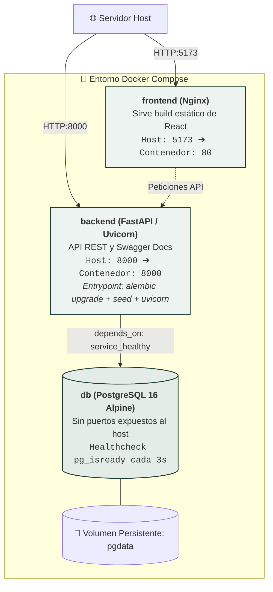
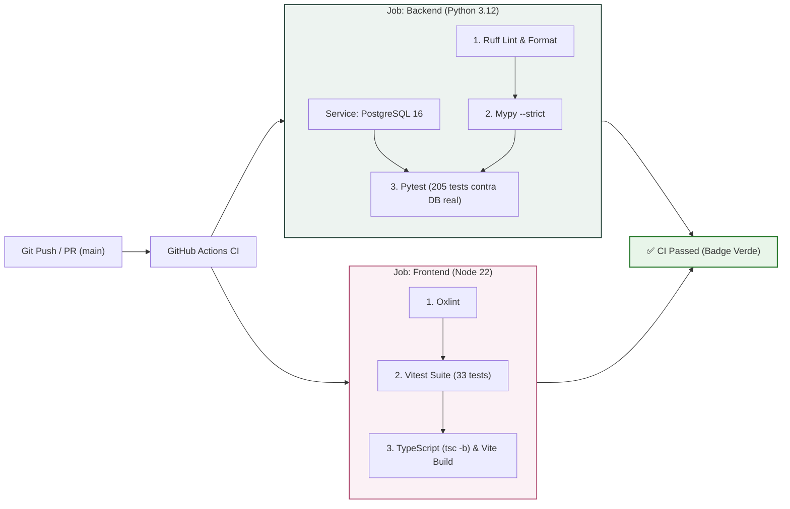

# 🚀 DevOps, Infraestructura y Pipeline CI/CD
## Sistema de Gestión de Acreditaciones Multi-Tenant — *Expo Flor Ecuador*

---

### Control del Documento
- **Documento ID:** DOC-08-OPS-CICD
- **Estándar:** arc42 Sección 7 / ISO/IEC 25010 (Operabilidad y Fiabilidad)
- **Versión:** 1.0.0
- **Fecha:** 2026-09-04

---

## 1. Topología de Infraestructura (Docker Compose)

El sistema se despliega mediante una configuración contenerizada autónoma y reproducible:



### Especificación de Servicios:

| Servicio | Imagen Base | Puertos Expuestos | Variables de Entorno Clave |
| :--- | :--- | :---: | :--- |
| **`db`** | `postgres:16-alpine` | Interno (5432) | `POSTGRES_DB`, `POSTGRES_USER`, `POSTGRES_PASSWORD` |
| **`backend`** | `python:3.12-slim` | `8000:8000` | `DATABASE_URL`, `JWT_SECRET_KEY`, `MAIL_SERVER`, `MAIL_PORT` |
| **`frontend`** | `nginx:alpine` | `5173:80` | `VITE_API_BASE_URL` |

---

## 2. Healthcheck y Orquestación Resiliente

Para evitar errores de conexión al arrancar el backend antes de que PostgreSQL acepte conexiones, se implementa una sonda de salud (*Healthcheck*) con dependencia condicional:

```yaml
services:
  db:
    image: postgres:16-alpine
    healthcheck:
      test: ["CMD-SHELL", "pg_isready -U expoflores -d expoflores"]
      interval: 3s
      timeout: 3s
      retries: 5

  backend:
    build: ./backend
    depends_on:
      db:
        condition: service_healthy
```

---

## 3. Pipeline de Integración Continua (GitHub Actions CI/CD)

El pipeline de CI se dispara en cada `push` o `pull_request` sobre la rama `main`, garantizando que ningún cambio degrade la calidad del código:



---

## 4. Comandos Operativos de Gestión

```bash
# 1. Levantar el entorno completo en segundo plano
docker compose up -d --build

# 2. Monitorear logs en tiempo real
docker compose logs -f backend

# 3. Ejecutar suite de pruebas en el contenedor de backend
docker compose exec backend pytest -v

# 4. Detener y limpiar contenedores preservando datos
docker compose down

# 5. Reiniciar borrando base de datos (Reset total)
docker compose down -v
docker compose up -d --build
```
