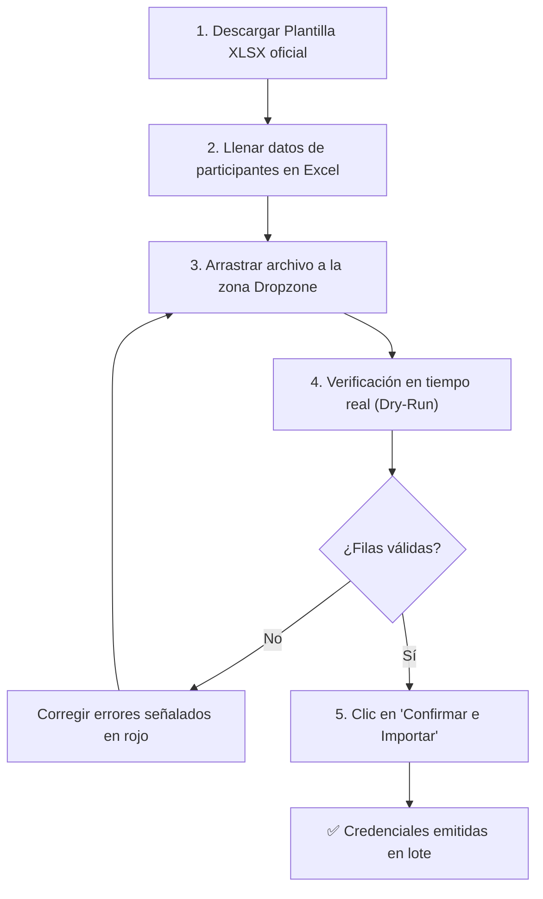

# 📖 Manual de Operación y Guía de Usuario
## Sistema de Gestión de Acreditaciones Multi-Tenant — *Expo Flor Ecuador*

---

### Control del Documento
- **Documento ID:** DOC-10-USR-MANUAL
- **Estándar:** ISO/IEC/IEEE 26512 (Requirements for User Documentation)
- **Versión:** 1.0.0
- **Fecha:** 2026-09-04

---

## 1. Guía para el Administrador de la Feria

### 1.1. Inicio de Sesión
1. Ingrese a la plataforma mediante la URL oficial o el acceso local: `http://localhost:5173/login`.
2. Ingrese sus credenciales de administrador:
   - **Email:** `admin@expoflores.com`
   - **Contraseña:** (Definida en variables de entorno / setup inicial).
3. El sistema redirigirá automáticamente al **Dashboard de Organización** (`/admin/dashboard`).

---

### 1.2. Registro de Empresas Expositoras
1. Diríjase a la sección **Expositores** en el menú de navegación lateral.
2. Haga clic en el botón **"+ Nuevo Expositor"**.
3. Complete el formulario de registro:
   - **Razón Social:** Nombre formal de la empresa florícola o proveedora.
   - **RUC / Identificación Fiscal:** 13 dígitos para empresas ecuatorianas o código fiscal internacional.
   - **Metraje Contratado ($m^2$):** Área física asignada en el recinto ferial.
   - **Representante Principal:** Nombre completo, correo electrónico y teléfono.
   - **Contactos Adicionales:** Correos o nombres comerciales alternativos.
4. Haga clic en **"Guardar Expositor"**.
   > **Proceso Automático:** El sistema creará la cuenta del expositor con `password_hash = NULL` y enviará un correo electrónico con el enlace de activación válido por 72 horas.

---

### 1.3. Reenvío de Invitaciones / Magic Links
Si un representante no activó su cuenta dentro del plazo de 72 horas:
1. Localice la empresa en el listado de expositores.
2. Ingrese al detalle del expositor y haga clic en **"Reenviar Invitación"**.
3. El sistema revocará el token anterior y generará uno nuevo con 72 horas adicionales de vigencia.

---

### 1.4. Configuración de Reglas de Feria
1. Ingrese a **Reglas de Feria** (`/admin/reglas`).
2. Puede ajustar:
   - **Rangos de Clasificación ($m^2$):** Metrajes para Modular, Isla Básica, Isla Grande, etc.
   - **Factores de Acreditación:** Cantidad de credenciales por bloque de metraje y modo de redondeo (`floor`, `ceil`, `round`).

---

## 2. Guía para el Representante de Stand

### 2.1. Activación de Cuenta por Primera Vez
1. Abra el correo electrónico recibido con el asunto: *"Bienvenido a Expo Flor Ecuador - Active su cuenta"*.
2. Haga clic en el enlace **"Establecer Contraseña"** o copie la URL en su navegador.
3. Ingrese una contraseña segura que cumpla con los requisitos mínimos:
   - Al menos 8 caracteres.
   - Combinación de letras y números.
4. Haga clic en **"Activar Cuenta"**. Será redirigido al panel de su stand.

---

### 2.2. Panel del Stand y Consulta de Cupos
En la pantalla principal de su stand (`/stand/dashboard`), podrá visualizar:
- **Área Contratada:** Metros cuadrados ($m^2$) de su espacio ferial.
- **Categoría del Stand:** Ej. *Modular Estándar* o *Isla Media*.
- **Indicadores de Cupos:** Barras de progreso con el cupo total, utilizados y disponibles para *Expositores*, *Invitados* y *Servicio*.

---

### 2.3. Acreditación Individual
1. En el menú, seleccione **"Mis Acreditados"** y haga clic en **"+ Acreditar Personal"**.
2. Seleccione la **Categoría**:
   - **Expositor:** Personal directo de su empresa que atenderá el stand.
   - **Invitado:** Clientes o visitantes VIP de su empresa.
   - **Servicio:** Personal de logística, montaje o decoración (Requiere indicar el nombre de la *Empresa Proveedora*).
3. Ingrese la **Cédula o Pasaporte**, Nombres, Apellidos y Correo electrónico.
4. Haga clic en **"Guardar y Emitir Credencial"**. El sistema validará la cuota disponible y descontará 1 cupo.

---

### 2.4. Carga Masiva con Archivo Excel (XLSX)
Para stands medianos o grandes, se recomienda el proceso de carga masiva:

---

## 3. Preguntas Frecuentes y Resolución de Problemas (FAQ)

### P1: ¿Qué hago si el enlace de activación de mi cuenta caducó?
**Respuesta:** Los enlaces de activación expiran por seguridad a las 72 horas. Comuníquese con la organización de la feria para que reenvíen una nueva invitación a su correo electrónico.

### P2: ¿Por qué el sistema rechaza una cédula diciendo que ya está registrada?
**Respuesta:** Por normativa de seguridad ferial, una misma persona física (cédula o pasaporte) solo puede portar una credencial oficial en toda la feria. Si la persona ya fue acreditada por otro stand o por la organización, no podrá ser duplicada.

### P3: ¿Puedo eliminar a una persona y recuperar el cupo?
**Respuesta:** Sí. Al eliminar a un participante desde la lista de "Mis Acreditados", la credencial queda cancelada de inmediato, la cédula se libera y el cupo vuelve a estar disponible para registrar a otra persona.

### P4: ¿Por qué es obligatorio el campo "Empresa Proveedora" en la categoría Servicio?
**Respuesta:** Por regulaciones de seguridad ocupacional y control de accesos al recinto ferial durante las fases de montaje y desmontaje, es obligatorio identificar la razón social de la contratista externa.
