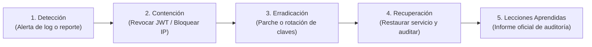

# 🔒 Manual de Seguridad de la Información, Privacidad y Auditoría
## Plataforma de Gestión de Acreditaciones Multi-Tenant — *Expo Flor Ecuador*

---

### Control del Documento
- **Documento ID:** MAN-SEC-04
- **Estándar:** ISO/IEC 27001:2022 / OWASP ASVS v4.0 / Ley Orgánica de Protección de Datos Personales (Ecuador)
- **Audiencia:** Oficiales de Seguridad de la Información (CISO), Auditores de TI y Oficiales de Privacidad (DPO)
- **Versión:** 1.0.0
- **Fecha:** 2026-09-04

---

## 1. Política de Control de Acceso y Segregación de Roles (RBAC)

La plataforma aplica el principio de **Mínimo Privilegio (Least Privilege)** y **Defensa en Profundidad (Defense in Depth)**.

```
┌────────────────────────────────────────────────────────────────────────┐
│                        MATRIZ DE PRIVILEGIOS RBAC                      │
├────────────────────────────────┬──────────────┬────────────────────────┤
│ Acción / Recurso               │ Admin Feria  │ Representante Stand    │
├────────────────────────────────┼──────────────┼────────────────────────┤
│ Crear / Dar de baja expositor  │ ✅ Total     │ ❌ Denegado            │
│ Modificar reglas y factores m² │ ✅ Total     │ ❌ Denegado            │
│ Ver métricas globales de feria │ ✅ Total     │ ❌ Denegado            │
│ Reenviar Magic Link a otro     │ ✅ Total     │ ❌ Denegado            │
│ Ver participantes de SU stand  │ ✅ Total     │ ✅ Permitido           │
│ Ver participantes de OTRO stand│ ✅ Total     │ ❌ Denegado (403/404)  │
│ Acreditar personal en SU stand │ ✅ Permitido │ ✅ Permitido           │
│ Acreditar personal en OTRO     │ ✅ Permitido │ ❌ Denegado            │
│ Carga Masiva XLSX en SU stand  │ ❌ No aplica │ ✅ Permitido           │
└────────────────────────────────┴──────────────┴────────────────────────┘
```

---

## 2. Cumplimiento de Protección de Datos Personales (LOPDP Ecuador)

En cumplimiento de la **Ley Orgánica de Protección de Datos Personales (Registro Oficial Suplemento 459 de 26-may.-2021)**:

### 2.1. Principios Aplicados:
1. **Principio de Minimización:** Solo se recolectan los datos estrictamente necesarios para la emisión de la credencial física/digital de acceso ferial (*Nombres, Apellidos, Cédula/Pasaporte, Correo, Categoría y Empresa Proveedora*).
2. **Principio de Finalidad:** Los datos personales no se comparten con terceros ni se utilizan con fines comerciales no autorizados.
3. **Derechos ARCO (Acceso, Rectificación, Cancelación y Oposición):**
   - **Rectificación:** El expositor o el titular pueden corregir sus nombres o correos en cualquier momento.
   - **Cancelación:** La eliminación de un participante borra físicamente su registro de la base de datos operativa, liberando su identificación.

---

## 3. Estándares Criptográficos Aplicados

```
┌────────────────────────────────────────────────────────────────────────┐
│                      ESTÁNDARES CRIPTOGRÁFICOS ACTIVOS                 │
├──────────────────────────┬─────────────────────────────────────────────┤
│ Función                  │ Algoritmo y Configuración                   │
├──────────────────────────┼─────────────────────────────────────────────┤
│ Hashing de Contraseñas   │ Bcrypt (Costo 12) / Argon2id                │
│ Tokens de Activación     │ SHA-256 (64 caracteres hex) con TTL de 72h │
│ Firma de Tokens JWT      │ HMAC-SHA256 (HS256) con clave de 256 bits   │
│ Transporte en Red        │ TLS 1.3 con certificados HSTS forzados      │
│ Prevención Anti-Timing   │ Verificación de hash sintético dummy en 401 │
└──────────────────────────┴─────────────────────────────────────────────┘
```

---

## 4. Mitigación contra el OWASP Top 10 (2021-2026)

| Vulnerabilidad OWASP | Riesgo Potencial | Mitigación Implementada en Expo Flor |
| :--- | :--- | :--- |
| **A01: Broken Access Control** | Acceso cruzado a participantes de otros stands (IDOR). | `EventScopedRepository` + inyección estricta de `exhibitor_id` y `event_id` desde los claims del token JWT. |
| **A02: Cryptographic Failures** | Fuga de contraseñas o tokens en texto plano. | Almacenamiento exclusivo de hashes Bcrypt y SHA-256; uso de HTTPS en tránsito. |
| **A03: Injection (SQLi / XSS)** | Inyección SQL o scripts maliciosos en nombres. | Consultas parametrizadas por ORM SQLAlchemy 2.0; sanitización y tipado estricto con Pydantic y React. |
| **A04: Insecure Design** | Sobreemisión de cupos por concurrencia. | Locking pesimista a nivel de fila (`SELECT ... FOR UPDATE`) en transacciones ACID de PostgreSQL. |
| **A05: Security Misconfiguration** | Exposición de puertos o Swagger en producción. | PostgreSQL sin puertos expuestos al host; CORS restringido por lista blanca. |
| **A07: Identification Failures** | Ataques de fuerza bruta y enumeración de usuarios. | Rate limiting por IP; comparación de tiempo constante con `_DUMMY_HASH`. |

---

## 5. Protocolo de Respuesta ante Incidentes de Seguridad (CSIRP)



### Acciones de Emergencia Inmediata:
1. **Compromiso de Clave Secreta (`JWT_SECRET_KEY`):** Modificar la variable en `.env` y reiniciar el backend (`docker compose restart backend`). Esto invalidará todas las sesiones activas instantáneamente.
2. **Ataque de Denegación de Servicio (DDoS):** Activar el filtrado de Cloudflare / WAF y ajustar las directivas de rate limit en Nginx.
