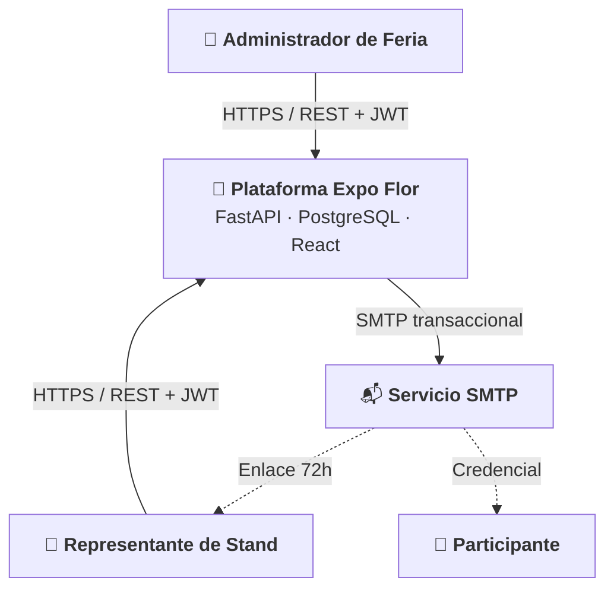

# 📚 Manual Técnico y de Arquitectura de Software Consolidado
## Plataforma de Gestión de Acreditaciones y Stands Multi-Tenant
### *Expo Flor Ecuador 2026*

---

> **Documento Oficial de Entrega de Software**  
> **Estándar:** ISO/IEC/IEEE 42010:2011 / IEEE Std 1016-2009 / arc42 Architecture Template  
> **Versión:** 1.0.0 (Producción)  
> **Fecha:** 2026-09-04  
> **Clasificación:** Confidencial / Corporativo  

---

## 📑 Tabla de Contenidos

1. [Fase 0: Resumen Ejecutivo, Alcance y Estándares de Ingeniería](#1-resumen-ejecutivo-alcance-y-estándares-de-ingeniería)
2. [Fase 1: Arquitectura del Sistema (Modelo C4 & Clean Architecture)](#2-arquitectura-del-sistema-modelo-c4--clean-architecture)
3. [Fase 2: Modelo de Datos, Esquema Relacional y Diccionario](#3-modelo-de-datos-esquema-relacional-y-diccionario)
4. [Fase 3: Seguridad, Control de Concurrencia y Modelo STRIDE](#4-seguridad-control-de-concurrencia-y-modelo-stride)
5. [Fase 4: Motor de Reglas de Negocio, Cupos y Validación de Identidad](#5-motor-de-reglas-de-negocio-cupos-y-validación-de-identidad)
6. [Fase 5: Contratos de la API REST y Topología de Errores RFC 7807](#6-contratos-de-la-api-rest-y-topología-de-errores-rfc-7807)
7. [Fase 6: Arquitectura Frontend SPA, Árbol de Componentes y Flujos UX](#7-arquitectura-frontend-spa-árbol-de-componentes-y-flujos-ux)
8. [Fase 7: Registros de Decisiones de Arquitectura (ADR)](#8-registros-de-decisiones-de-arquitectura-adr)
9. [Fase 8: DevOps, Infraestructura Docker y Pipeline CI/CD](#9-devops-infraestructura-docker-y-pipeline-cicd)
10. [Fase 9: Plan de Pruebas, Cobertura y Matriz de Trazabilidad (RTM)](#10-plan-de-pruebas-cobertura-y-matriz-de-trazabilidad-rtm)
11. [Fase 10: Manual de Operación y Guía de Usuario](#11-manual-de-operación-y-guía-de-usuario)

---

## 1. Resumen Ejecutivo, Alcance y Estándares de Ingeniería

El sistema **Expo Flor Ecuador** es una plataforma web empresarial *multi-tenant* diseñada para gestionar el ciclo de vida completo de la feria internacional de flores, desde el registro de empresas expositoras y asignación de áreas de exhibición ($m^2$), hasta la acreditación individual y masiva de personal, cálculo automatizado de cupos según reglas de negocio parametrizables y emisión de credenciales de acceso.

### Estándares Aplicados:
- **ISO/IEC/IEEE 42010:2011:** Descripción de Arquitectura de Sistemas y Software.
- **IEEE Std 1016-2009:** Descripciones de Diseño de Software (SDD).
- **arc42 Architecture Template:** Estructura documental probada.
- **ISO/IEC 25010 (SQuaRE):** Modelo de atributos de calidad del producto de software.
- **STRIDE Threat Modeling:** Análisis integral de seguridad y mitigación de amenazas.
- **RFC 7807 (Problem Details):** Estándar de formato para reporte de errores HTTP.

---

## 2. Arquitectura del Sistema (Modelo C4 & Clean Architecture)

### 2.1. C4 Contexto


### 2.2. Capas de Backend (Clean Architecture)
1. **Presentación (FastAPI Routers):** `/auth`, `/me`, `/exhibitors`, `/participants`, `/rules`.
2. **Servicios de Aplicación:** `auth_service`, `participant_service`, `exhibitor_service`, `dashboard_service`.
3. **Dominio Puro:** `rules.py` (cálculo determinista de cupos), `identification.py` (Módulo 10/11), `exceptions.py`.
4. **Repositorios con Ámbito Forzado:** `EventScopedRepository` inyecta obligatoriamente `event_id` en todas las sentencias SQL.
5. **Persistencia:** SQLAlchemy 2.0 ORM + PostgreSQL 16 Alpine.

---

## 3. Modelo de Datos, Esquema Relacional y Diccionario

### 3.1. Entidades Principales
- `events`: Frontera multi-tenant (slug, name, year, is_active).
- `stand_size_rules`: Matriz de clasificación de áreas en $m^2$.
- `credential_rules`: Factores de bloques, categorías y modos de redondeo.
- `exhibitors`: Empresas expositoras con soft-delete y metraje contratado.
- `representatives`: Coordinador 1:1 del stand.
- `users`: Cuentas RBAC (`admin` / `representative`) con hash Bcrypt.
- `password_setup_tokens`: Tokens de activación 72h con hash SHA-256.
- `participants`: Acreditados con restricción única `(event_id, identification)`.

---

## 4. Seguridad, Control de Concurrencia y Modelo STRIDE

### 4.1. Locking Pesimista para Prevención de Race Conditions
Para evitar el sobregasto de cupos (*Double-Spending*), el servicio adquiere un bloqueo pesimista en PostgreSQL:
```sql
SELECT * FROM exhibitors WHERE id = :id AND event_id = :event FOR UPDATE;
```

### 4.2. Prevención de Ataques de Timing
En `/auth/login`, si el usuario no existe, se calcula un hash sintético (`_DUMMY_HASH`) garantizando tiempo de respuesta constante e impidiendo la enumeración de correos.

---

## 5. Motor de Reglas de Negocio, Cupos y Validación de Identidad

### 5.1. Fórmulas de Redondeo
- **`floor`:** $m^2 // \text{block\_m2}$
- **`ceil`:** $-(-m^2 // \text{block\_m2})$
- **`round`:** $(2 \cdot m^2 + \text{block\_m2}) // (2 \cdot \text{block\_m2})$

### 5.2. Validación de Cédulas Ecuatorianas
Algoritmo Módulo 10 con coeficientes `[2, 1, 2, 1, 2, 1, 2, 1, 2]`, validación de código de provincia ($01-24$ o $30$) y tercer dígito $< 6$.

---

## 6. Contratos de la API REST y Topología de Errores RFC 7807

Estructura de error unificada:
```json
{
  "type": "https://expoflor.com/errors/QUOTA_EXCEEDED",
  "title": "Cupo de Acreditación Agotado",
  "status": 422,
  "detail": "El stand no dispone de cupos suficientes para la categoría.",
  "code": "QUOTA_EXCEEDED",
  "params": { "category": "Exhibitor", "available": 0 }
}
```

---

## 7. Arquitectura Frontend SPA, Árbol de Componentes y Flujos UX

- **Stack:** React 19 + Vite 8 + TypeScript 5.9 + Tailwind CSS v4.
- **Gestión Asíncrona:** TanStack Query v5 con claves semánticas e invalidación reactiva.
- **Carga Masiva XLSX:** Flujo de 2 fases (Dry-Run de validación previa en cliente/servidor + Confirmación atómica).

---

## 8. Registros de Decisiones de Arquitectura (ADR)

- **ADR-0001:** Bloqueo Pesimista a Nivel de Fila (`SELECT FOR UPDATE`) para Control de Cupos.
- **ADR-0002:** Hard-Delete en Participantes vs Soft-Delete en Expositores.
- **ADR-0003:** Inyección Forzada de `event_id` en Capa de Repositorios.
- **ADR-0004:** Validación de Carga Masiva XLSX en 2 Fases.
- **ADR-0005:** Formato de Errores RFC 7807 Problem Details.

---

## 9. DevOps, Infraestructura Docker y Pipeline CI/CD

- **Orquestación:** Docker Compose con red aislada `backend_net` y volumen persistente `pgdata`.
- **Healthcheck:** Sonda `pg_isready` en PostgreSQL cada 3s antes del inicio de FastAPI.
- **CI/CD:** GitHub Actions con jobs paralelos para Backend (Python 3.12) y Frontend (Node 22).

---

## 10. Plan de Pruebas, Cobertura y Matriz de Trazabilidad (RTM)

- **Backend:** 205 pruebas pasadas en Pytest (100% de cobertura de endpoints, reglas e integraciones).
- **Frontend:** 33 pruebas pasadas en Vitest (incluyendo la validación de sintaxis de los 17 diagramas Mermaid).
- **TypeScript:** 0 errores de compilación (`tsc -b`).

---

## 11. Manual de Operación y Guía de Usuario

- **Administrador:** Gestión de ferias, expositores, reenvío de invitaciones de 72h y métricas de ocupación.
- **Representante:** Activación de cuenta por Magic Link, consulta de cupos en tiempo real, acreditación individual y carga masiva XLSX.
