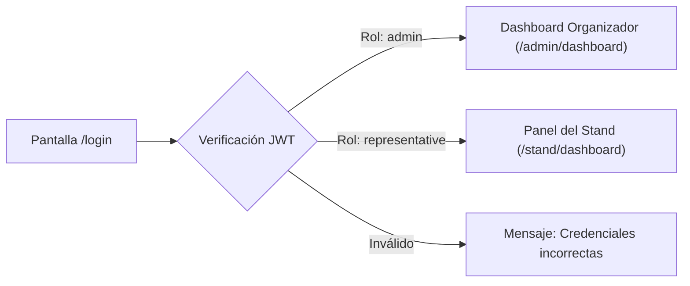

# 📘 Manual de Usuario: Administrador de Feria
## Plataforma de Gestión de Acreditaciones y Stands — *Expo Flor Ecuador*

---

### Control del Documento
- **Documento ID:** MAN-ADM-01
- **Estándar:** ISO/IEC/IEEE 26512 / IEEE Std 1016
- **Audiencia:** Directores de Operaciones, Administradores de Acreditación y Personal de Soporte de Expoflores
- **Versión:** 1.0.0
- **Fecha:** 2026-09-04

---

## 1. Introducción y Perfil de Acceso

El rol de **Administrador de Feria (`admin`)** posee el nivel más alto de privilegios dentro de la plataforma. Es el responsable de configurar los parámetros globales del evento ferial, administrar el registro de empresas expositoras, supervisar la ocupación de stands, auditar las acreditaciones emitidas en tiempo real y atender incidencias operativas.

```
┌────────────────────────────────────────────────────────────────────────┐
│                        PRIVILEGIOS DEL ADMINISTRADOR                   │
├────────────────────────────────────────────────────────────────────────┤
│ ✅ Gestión integral de expositores (Alta, baja, edición de metraje m²) │
│ ✅ Configuración dinámica de reglas de negocio y factores de cupos     │
│ ✅ Dashboard analítico con métricas de ocupación y cupos globales      │
│ ✅ Reenvío y revocación de Magic Links de activación (72h TTL)        │
│ ✅ Búsqueda global de participantes y detección de cédulas duplicadas  │
│ ✅ Exportación de reportes consolidados en formato Excel / CSV         │
└────────────────────────────────────────────────────────────────────────┘
```

---

## 2. Acceso y Autenticación Administrativa

### Paso 1: Ingreso a la Plataforma
1. Abra su navegador web (Google Chrome, Mozilla Firefox, Microsoft Edge o Safari).
2. Diríjase a la URL de la plataforma (ej. `https://acreditaciones.expoflor.com/login` o en entorno local `http://localhost:5173/login`).
3. Introduzca sus credenciales de administrador:
   - **Correo Electrónico:** Correo institucional registrado (ej. `admin@expoflores.com`).
   - **Contraseña:** Su clave de acceso cifrada.
4. Haga clic en **"Iniciar Sesión"**.



---

## 3. Panel de Control y Métricas de Feria (`/admin/dashboard`)

El Dashboard de Organización ofrece una vista ejecutiva de la feria con indicadores clave de rendimiento (KPIs):

### Indicadores Principales:
1. **Total de Stands Registrados:** Cantidad de empresas expositoras activas vs dadas de baja.
2. **Metraje Total Contratado ($m^2$):** Sumatoria de área de exhibición ocupada en el recinto ferial.
3. **Distribución de Cupos Emitidos vs Disponibles:**
   - **Expositores:** Credenciales de personal directo emitidas vs cupo total contratado.
   - **Invitados:** Credenciales de cortesía y clientes VIP consumidas.
   - **Servicio:** Personal de logística, montaje y contratistas autorizados.
4. **Estado de Onboarding:** Porcentaje de stands que han activado su cuenta y establecido contraseña.

---

## 4. Gestión de Empresas Expositoras (`/admin/expositores`)

### 4.1. Registrar una Nueva Empresa Expositora
1. En el menú de navegación lateral, seleccione **"Expositores"**.
2. Haga clic en el botón superior derecho **"+ Nuevo Expositor"**.
3. Complete los campos obligatorios del formulario:
   - **Razón Social:** Nombre legal o comercial de la empresa florícola (ej. *Flores del Valle S.A.*).
   - **Identificación Fiscal (RUC / DNI):** 13 dígitos para empresas ecuatorianas o código fiscal internacional. El sistema valida la unicidad en la feria.
   - **Metraje Contratado ($m^2$):** Área física asignada (ej. `24` o `48`). El sistema calculará automáticamente la categoría de stand y la cuota de credenciales.
   - **Nombre del Representante:** Nombre y apellidos del coordinador principal.
   - **Correo Electrónico del Representante:** Correo corporativo al cual se remitirá la invitación de autoservicio.
   - **Teléfono de Contacto:** Celular o directo para emergencias operativas.
   - *(Opcional)* **Contactos Adicionales:** Agregue contactos comerciales o de apoyo haciendo clic en *"+ Añadir Contacto"*.
4. Haga clic en **"Guardar y Emitir Invitación"**.

> **Comportamiento del Sistema:**
> El backend crea la empresa, asocia al representante, crea una cuenta de usuario con contraseña no establecida (`password_hash = NULL`) y genera un token criptográfico de activación que se envía automáticamente por correo con vigencia de 72 horas.

---

### 4.2. Editar Datos o Metraje de un Expositor
1. En la lista de expositores, localice la empresa deseada mediante la barra de búsqueda rápida (búsqueda por nombre, RUC o email).
2. Haga clic en la fila o en el botón de acción **"Editar"**.
3. Modifique los datos necesarios (ej. incremento de metraje de $24\,m^2$ a $36\,m^2$).
4. Haga clic en **"Actualizar Expositor"**.
   > **Aviso de Negocio:** Si se incrementa el metraje, los cupos disponibles del stand se recalcularán y aumentarán inmediatamente. Si se reduce el metraje, el sistema verificará que la nueva cuota no sea menor a las credenciales ya emitidas.

---

### 4.3. Reenvío de Enlace de Activación (Magic Link)
Si el representante no activó su cuenta antes de que caduque el enlace de 72 horas:
1. Ingrese a la ficha del expositor.
2. Observe el estado de la cuenta: aparecerá como **"Pendiente de Activación"** o **"Token Expirado"**.
3. Haga clic en el botón **"Reenviar Invitación"**.
4. El sistema invalidará el token previo y despachará un nuevo correo con un nuevo enlace de activación de 72 horas.

---

### 4.4. Baja Lógica de un Expositor (Soft-Delete)
1. En la ficha del expositor, haga clic en el botón **"Eliminar Expositor"**.
2. Aparecerá un cuadro de diálogo de confirmación indicando las consecuencias.
3. Al confirmar, el sistema ejecuta un *Soft-Delete* (`deleted_at = NOW()`):
   - El stand ya no podrá iniciar sesión.
   - Las credenciales emitidas quedan bloqueadas en los controles de acceso.
   - Se preserva el historial para auditoría comercial y contable.
   - Se libera el RUC para permitir un nuevo registro futuro si fuera necesario.

---

## 5. Configuración de Reglas de Feria (`/admin/reglas`)

La plataforma permite ajustar la lógica de negocio ferial en cualquier momento:

### 5.1. Matriz de Clasificación de Metraje ($m^2$)
Permite definir los límites de tamaño para cada tipo de stand:
- **Modular Pequeño:** $1\,m^2$ a $12\,m^2$.
- **Modular Estándar:** $13\,m^2$ a $24\,m^2$.
- **Isla Media:** $25\,m^2$ a $48\,m^2$.
- **Isla Grande:** $49\,m^2$ a $99\,m^2$.
- **Pabellón Corporativo:** $100\,m^2$ a $500\,m^2$.

### 5.2. Factores de Asignación de Credenciales
Permite ajustar cuántas credenciales se otorgan por cada bloque de área:
- **Exhibitor:** Factor de credenciales por bloque (ej. $2$ credenciales por cada $12\,m^2$).
- **Guest:** Factor de credenciales por bloque (ej. $1$ credencial por cada $12\,m^2$).
- **Service:** Factor de credenciales por bloque (ej. $1$ credencial por cada $24\,m^2$).
- **Modo de Redondeo:**
  - `floor`: Redondeo hacia abajo (estricto por bloques completos).
  - `ceil`: Redondeo hacia arriba (favorece al expositor ante cualquier fracción).
  - `round`: Redondeo aritmético estándar.

---

## 6. Búsqueda Global de Participantes y Auditoría (`/admin/participantes`)

1. Ingrese a la sección **"Participantes Globales"**.
2. Utilice el buscador para localizar personas acreditadas por:
   - Cédula de identidad, RUC o pasaporte.
   - Nombres o apellidos.
   - Nombre de la empresa expositora responsable.
   - Categoría de credencial (*Expositor, Invitado, Servicio*).
3. **Exportación de Datos:** Haga clic en **"Exportar Listado (Excel)"** para descargar la base de datos completa de acreditados para impresión física de credenciales o sincronización con los torniquetes de acceso ferial.
