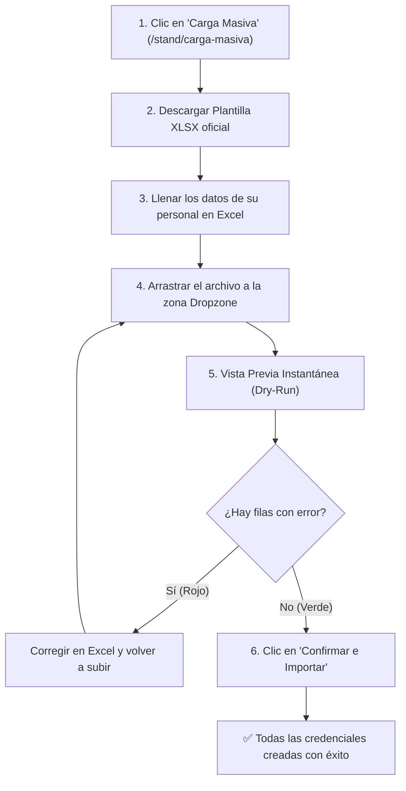

# 📙 Manual de Usuario: Representante de Stand / Expositor
## Plataforma de Gestión de Acreditaciones y Stands — *Expo Flor Ecuador*

---

### Control del Documento
- **Documento ID:** MAN-REP-02
- **Estándar:** ISO/IEC/IEEE 26512 (Directrices de Documentación para el Usuario Final)
- **Audiencia:** Representantes Legales, Coordinadores de Stand y Responsables de Acreditación de Empresas Expositoras
- **Versión:** 1.0.0
- **Fecha:** 2026-09-04

---

## 1. Introducción al Portal de Autoservicio

Bienvenido al portal de acreditaciones de **Expo Flor Ecuador**. A través de esta plataforma web podrá gestionar de forma autónoma las credenciales de ingreso para el personal de su stand, invitados especiales y personal de montaje o logística.

```
┌────────────────────────────────────────────────────────────────────────┐
│                      CAPACIDADES DE SU PANEL DE STAND                  │
├────────────────────────────────────────────────────────────────────────┤
│ 📊 Visualización de cupos disponibles y consumidos en tiempo real     │
│ 👤 Acreditación individual de colaboradores con validación inmediata   │
│ 📁 Carga masiva rápida mediante archivo Excel (XLSX) con vista previa  │
│ ✏️ Edición de datos de participantes y reenvío de credenciales digitales│
│ 🗑️ Cancelación de participantes con liberación inmediata de cupos       │
└────────────────────────────────────────────────────────────────────────┘
```

---

## 2. Activación de su Cuenta (Primer Ingreso)

### Paso 1: Recepción del Correo de Invitación
Tras ser registrado por la organización de la feria, recibirá un correo electrónico oficial de **Expo Flor Ecuador** con el asunto: *"Bienvenido a Expo Flor Ecuador - Active su cuenta"*.

> **⚠️ Importante:** El enlace de activación tiene una vigencia estricta de **72 horas**. Si no activa su cuenta en este periodo, deberá solicitar al organizador el reenvío de una nueva invitación.

### Paso 2: Configuración de su Contraseña
1. Haga clic en el botón **"Activar Cuenta / Establecer Contraseña"** del correo.
2. Se abrirá la página segura de activación (`/establecer-clave?token=...`).
3. Ingrese y confirme su nueva contraseña de acceso, la cual debe cumplir con los siguientes requisitos:
   - Mínimo **8 caracteres**.
   - Al menos una letra mayúscula o minúscula.
   - Al menos un número.
4. Haga clic en **"Guardar y Activar Cuenta"**.
5. El sistema activará su usuario y lo ingresará automáticamente al panel principal de su stand.

---

## 3. Panel Principal del Stand (`/stand/dashboard`)

En la pantalla de inicio encontrará el resumen contractual y el balance de cupos de su empresa:

```
┌────────────────────────────────────────────────────────────────────────┐
│                        PANEL DE CONTROL DEL STAND                      │
├────────────────────────────────────────────────────────────────────────┤
│ Empresa: FLORES DEL VALLE S.A.         RUC: 1792345678001              │
│ Área Contratada: 24 m²                 Tipo de Stand: Modular Estándar │
├────────────────────────────────────────────────────────────────────────┤
│ BALANCE DE CUPOS:                                                      │
│ • Personal de Stand (Expositor):  [████████░░] 4 / 6 Asignados (2 disp)│
│ • Invitados Especiales (Guest):   [████░░░░░░] 2 / 4 Asignados (2 disp)│
│ • Personal de Servicio (Service): [██████████] 1 / 1 Asignado  (0 disp)│
└────────────────────────────────────────────────────────────────────────┘
```

### Categorías de Credenciales:
1. **Expositor (`Exhibitor`):** Para los ejecutivos comerciales, agrónomos y personal de su propia empresa que atenderán el stand durante todos los días de feria.
2. **Invitado (`Guest`):** Para clientes importantes, compradores internacionales o invitados VIP.
3. **Servicio (`Service`):** Para personal de montaje, electricistas, decoradores, transporte o catering que requieren acceso durante las fases operativas.

---

## 4. Acreditación Individual de Personal

1. En el menú lateral, seleccione **"Mis Acreditados"** (`/stand/participantes`).
2. Haga clic en el botón superior derecho **"+ Acreditar Personal"**.
3. Complete el formulario:
   - **Categoría:** Seleccione *Expositor*, *Invitado* o *Servicio*.
   - **Cédula / Pasaporte:** Ingrese el número de identificación. Si es cédula ecuatoriana (10 dígitos), el sistema validará automáticamente que los dígitos y el código de provincia sean correctos.
   - **Nombres y Apellidos:** Nombre completo del participante.
   - **Correo Electrónico (Opcional pero recomendado):** Si lo ingresa, el sistema enviará la credencial digital con código de acceso directamente a la persona.
   - **Empresa Proveedora:** *(Solo si seleccionó la categoría Servicio)*. Escriba la razón social de la empresa contratista (ej. *Montajes & Sonido Cía. Ltda.*).
4. Haga clic en **"Guardar y Emitir Credencial"**.
5. Si el stand dispone de cupo en la categoría seleccionada, la credencial se emitirá en menos de 1 segundo y el contador de cupos se actualizará automáticamente.

---

## 5. Carga Masiva con Archivo Excel (XLSX)

Para stands con más de 5 personas, se recomienda la importación masiva:



### 5.1. Estructura Obligatoria de Columnas en el Excel
La plantilla oficial cuenta con las siguientes columnas exactas:

| Columna en Excel | Obligatorio | Descripción / Valores Aceptados | Ejemplo |
| :--- | :---: | :--- | :--- |
| `identificacion` | SÍ | Cédula ecuatoriana de 10 dígitos o Pasaporte alfanumérico. | `1712345678` |
| `nombres` | SÍ | Nombres del participante. | `María José` |
| `apellidos` | SÍ | Apellidos del participante. | `Pérez Gómez` |
| `categoria` | SÍ | Uno de: `Expositor`, `Invitado` o `Servicio`. | `Expositor` |
| `email` | NO | Correo para despacho digital de credencial. | `maria.perez@empresa.com` |
| `empresa_proveedora` | CONDICIONAL | **Obligatorio solo si la categoría es Servicio**. | `Logística Floral S.A.` |

### 5.2. Interpretación de la Vista Previa (Dry-Run)
- **Filas en Verde (Válidas):** Cumplen con todas las reglas de formato, el número de cédula es válido y su stand tiene cupo suficiente para el lote.
- **Filas en Rojo (Inconsistencias):** Indican el motivo exacto del problema (ej. *"Cédula ecuatoriana con dígito verificador inválido"*, *"Cédula ya acreditada en otro stand"* o *"Cupo de Invitados superado por 2 personas"*).
- **Confirmación Segura:** El botón **"Confirmar e Importar"** solo se habilitará cuando todo el archivo esté libre de errores, garantizando una carga 100% limpia.

---

## 6. Modificación y Eliminación de Acreditaciones

### 6.1. Corregir Datos de una Persona
1. En **"Mis Acreditados"**, localice a la persona y haga clic en el botón de edición (ícono de lápiz).
2. Podrá actualizar nombres, apellidos o agregar un correo electrónico si no lo tenía.
3. Haga clic en **"Guardar Cambios"**.

### 6.2. Eliminar una Acreditación y Recuperar el Cupo
Si un colaborador ya no asistirá al evento o cometió una equivocación:
1. En la lista, haga clic en el botón **"Eliminar"** (ícono de papelera).
2. Confirme la acción en el cuadro de diálogo.
3. **Efecto Inmediato:**
   - La credencial queda cancelada en los controles de acceso.
   - El cupo asignado a esa categoría se **libera de inmediato**.
   - La cédula de identidad queda disponible para ser registrada nuevamente si fuera necesario.

---

## 7. Preguntas Frecuentes y Soporte (FAQ)

### ¿Qué ocurre si me quedo sin cupos en una categoría?
El sistema le impedirá emitir credenciales adicionales en esa categoría. Si su stand requiere mayor cantidad de pases debido al volumen de su delegación, comuníquese con el Administrador de la feria para evaluar una ampliación de metraje o adquisición de cupos adicionales.

### ¿Puedo registrar la misma persona como Expositor y como Invitado?
No. La normativa ferial exige una sola credencial por persona física. Si intenta registrar una cédula ya existente, el sistema emitirá una alerta de duplicidad.

### ¿Dónde descargo las credenciales para imprimirlas?
En la pestaña **"Mis Acreditados"**, puede hacer clic en **"Exportar Listado"** para obtener un archivo con la totalidad de su personal registrado, o bien verificar el correo de cada acreditado donde se adjunta su credencial digital con código de barras/QR.
